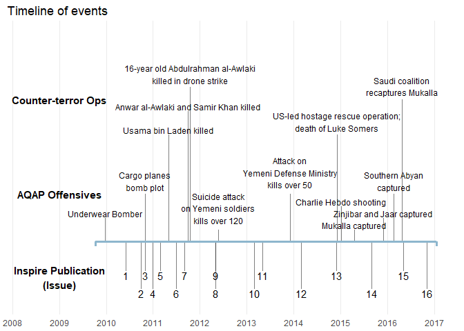

# Inspire
Soo Wan Kim  
April 25, 2017  


## About

table


```r
table <- hist %>%
  select(Issue, CoverStory, ReleaseDate, TotalPages) %>%
  transform(ReleaseDate = as.Date(ReleaseDate, "%m/%d/%y")) %>%
  mutate(ReleaseYear = as.character(year(ReleaseDate))) %>%
  mutate(ReleaseMonth = month.abb[month(ReleaseDate)]) %>%
  transform(ReleaseDate = paste(ReleaseMonth, ReleaseYear)) %>%
  select(-ReleaseYear, -ReleaseMonth) %>%
  transform(CoverStory = as.character(CoverStory)) %>%
  transform(CoverStory = ifelse(Issue == 3, "$4,200", CoverStory))

table %>%
  kable(format = "html", col.names = c("Issue", "Cover Story", "Release Date", "# Pages"))
```

<table>
 <thead>
  <tr>
   <th style="text-align:right;"> Issue </th>
   <th style="text-align:left;"> Cover Story </th>
   <th style="text-align:left;"> Release Date </th>
   <th style="text-align:right;"> # Pages </th>
  </tr>
 </thead>
<tbody>
  <tr>
   <td style="text-align:right;"> 1 </td>
   <td style="text-align:left;"> May our souls be sacrified for you! - Shaykh Anwar al-Awlaki </td>
   <td style="text-align:left;"> Jun 2010 </td>
   <td style="text-align:right;"> 66 </td>
  </tr>
  <tr>
   <td style="text-align:right;"> 2 </td>
   <td style="text-align:left;"> Photos from the Operations of Abyan </td>
   <td style="text-align:left;"> Oct 2010 </td>
   <td style="text-align:right;"> 73 </td>
  </tr>
  <tr>
   <td style="text-align:right;"> 3 </td>
   <td style="text-align:left;"> $4,200 </td>
   <td style="text-align:left;"> Nov 2010 </td>
   <td style="text-align:right;"> 22 </td>
  </tr>
  <tr>
   <td style="text-align:right;"> 4 </td>
   <td style="text-align:left;"> The Ruling on Dispossessing the Disbelievers Wealth in Dar al-Harb </td>
   <td style="text-align:left;"> Jan 2011 </td>
   <td style="text-align:right;"> 66 </td>
  </tr>
  <tr>
   <td style="text-align:right;"> 5 </td>
   <td style="text-align:left;"> The Tsunami of Change </td>
   <td style="text-align:left;"> Mar 2011 </td>
   <td style="text-align:right;"> 69 </td>
  </tr>
  <tr>
   <td style="text-align:right;"> 6 </td>
   <td style="text-align:left;"> Sadness, Contentment and Aspiration </td>
   <td style="text-align:left;"> Jul 2011 </td>
   <td style="text-align:right;"> 60 </td>
  </tr>
  <tr>
   <td style="text-align:right;"> 7 </td>
   <td style="text-align:left;"> The Greatest Special Operation of All Time </td>
   <td style="text-align:left;"> Sep 2011 </td>
   <td style="text-align:right;"> 37 </td>
  </tr>
  <tr>
   <td style="text-align:right;"> 8 </td>
   <td style="text-align:left;"> Targeting Dar al-Harb Populations </td>
   <td style="text-align:left;"> May 2012 </td>
   <td style="text-align:right;"> 62 </td>
  </tr>
  <tr>
   <td style="text-align:right;"> 9 </td>
   <td style="text-align:left;"> Wining on the Ground </td>
   <td style="text-align:left;"> May 2012 </td>
   <td style="text-align:right;"> 61 </td>
  </tr>
  <tr>
   <td style="text-align:right;"> 10 </td>
   <td style="text-align:left;"> We Are All Usama </td>
   <td style="text-align:left;"> Mar 2013 </td>
   <td style="text-align:right;"> 60 </td>
  </tr>
  <tr>
   <td style="text-align:right;"> 11 </td>
   <td style="text-align:left;"> Who and Why </td>
   <td style="text-align:left;"> May 2013 </td>
   <td style="text-align:right;"> 38 </td>
  </tr>
  <tr>
   <td style="text-align:right;"> 12 </td>
   <td style="text-align:left;"> Shattered: A Story About Change </td>
   <td style="text-align:left;"> Mar 2014 </td>
   <td style="text-align:right;"> 71 </td>
  </tr>
  <tr>
   <td style="text-align:right;"> 13 </td>
   <td style="text-align:left;"> Neurotmesis: Cutting the Nerves and Isolating the Head </td>
   <td style="text-align:left;"> Dec 2014 </td>
   <td style="text-align:right;"> 111 </td>
  </tr>
  <tr>
   <td style="text-align:right;"> 14 </td>
   <td style="text-align:left;"> Assassination Operations </td>
   <td style="text-align:left;"> Sep 2015 </td>
   <td style="text-align:right;"> 87 </td>
  </tr>
  <tr>
   <td style="text-align:right;"> 15 </td>
   <td style="text-align:left;"> Professional Assassinations </td>
   <td style="text-align:left;"> May 2016 </td>
   <td style="text-align:right;"> 89 </td>
  </tr>
  <tr>
   <td style="text-align:right;"> 16 </td>
   <td style="text-align:left;"> The 9/17 Operations </td>
   <td style="text-align:left;"> Nov 2016 </td>
   <td style="text-align:right;"> 47 </td>
  </tr>
</tbody>
</table>

## History

timeline of publication and major events


```r
timeline <- read.csv("Data/timeline.csv") %>%
  transform(Date = as.Date(Date, "%m/%d/%Y")) %>%
  transform(Event = as.character(Event)) %>%
  transform(Event = str_replace_all(Event, "<br />", "\n"))

blue <- "#8DB6CD"

ggplot() + 
  geom_segment(aes(x = Date, y = Disp, xend = Date), data = timeline, yend = 0,
               size = 0.08, alpha = 0.5) + 
  geom_segment(aes(x = Date[1] - 75, y = 0, xend = Date[length(Date)] + 75), data = timeline, yend = 0,
               color = blue, size = 1.2) + 
  geom_segment(aes(x = Date[1] - 75, y = -0.08, xend = Date[1] - 75), data = timeline, yend = 0,
               color = blue, size = 1.2) + 
  geom_segment(aes(x = Date[length(Date)] + 75, y = -0.08, 
                   xend = Date[length(Date)] + 75), data = timeline, yend = 0,
               color = blue, size = 1.2) + 
  geom_text(aes(x = Date, y = Disp, label = Event), data = filter(timeline, Inspire == 1),
            vjust = 1) + 
  geom_text(aes(x = Date, y = Disp, label = Event), data = filter(timeline, Offensive == 1),
            vjust = -0.2, size = 3.2) + 
  geom_text(aes(x = Date, y = Disp, label = Event), data = filter(timeline, CT == 1),
            vjust = -0.2, size = 3.2) + 
  annotate(geom = "text", x = as.Date("1/1/2009", "%m/%d/%Y"), 
           y = -0.6, label = "Inspire Publication\n(Issue)", fontface = "bold") +
  annotate(geom = "text", x = as.Date("1/1/2009", "%m/%d/%Y"), 
           y = 0.8, label = "AQAP Offensives", fontface = "bold") +
  annotate(geom = "text", x = as.Date("1/1/2009", "%m/%d/%Y"), 
           y = 2.4, label = "Counter-terror Ops", fontface = "bold") +
  scale_x_date(limits = c(as.Date("5/1/2008", "%m/%d/%Y"), timeline$Date[length(timeline$Date)] + 90),
               date_breaks = "1 year", date_labels = "%Y") + 
  ylim(-1, 3.5) + 
  labs(title = "Timeline of events") + 
  theme_minimal() + 
  theme(axis.title.x = element_blank(),
    axis.title.y = element_blank(),
        axis.text.y = element_blank(),
        axis.line.y = element_blank(),
    panel.grid.minor.x = element_blank(),
        panel.grid.major.y = element_blank(),
        panel.grid.minor.y = element_blank())
```

<!-- -->

to fix: spacing, font type, etc.

## Content

explanation of different content categories


```r
cat_type <- catalogue %>%
  group_by(ItemType) %>%
  summarize(SumPages = sum(NumPages)) %>%
  arrange(desc(SumPages)) %>%
  mutate(TotPages = sum(SumPages)) %>%
  mutate(page_freq_weight = SumPages/TotPages) %>%
  transform(ItemType = as.factor(ItemType)) %>%
  transform(ItemType = factor(ItemType, levels = ItemType))

cat_all <- ggplot(cat_type, aes(ItemType, page_freq_weight)) + 
  geom_point(color = "#5F9F9F") + 
  geom_segment(aes(x = ItemType, y = 0, xend = ItemType, yend = page_freq_weight - 0.005)) + 
  labs(title = "Percentage of articles written for Inspire, by issue",
       x = "Issue", y = "Percentage of articles") + 
  scale_y_continuous(limits = c(0, 0.3), breaks = seq(0, 0.3, .1), labels=percent) + 
  theme(panel.grid.minor = element_blank(),
        panel.grid.major.x = element_blank(),
        axis.text.x = element_text(angle = -60, hjust = 0.3))

pcat_all <- plotly_build(cat_all)

pcat_all
```

<!--html_preserve--><div id="c3841e57f84" style="width:672px;height:480px;" class="plotly html-widget"></div>
<script type="application/json" data-for="c3841e57f84">{"x":{"data":[{"x":[1,2,3,4,5,6,7,8,9,10,11,12],"y":[0.227322404371585,0.187978142076503,0.118032786885246,0.0743169398907104,0.0672131147540984,0.0628415300546448,0.0612021857923497,0.0546448087431694,0.0475409836065574,0.0431693989071038,0.033879781420765,0.0218579234972678],"text":["ItemType: Ideology<br />page_freq_weight: 0.22732240","ItemType: How-To Guides<br />page_freq_weight: 0.18797814","ItemType: News<br />page_freq_weight: 0.11803279","ItemType: Advertisement<br />page_freq_weight: 0.07431694","ItemType: Opinion<br />page_freq_weight: 0.06721311","ItemType: Strategy<br />page_freq_weight: 0.06284153","ItemType: Eulogy/Martyrology<br />page_freq_weight: 0.06120219","ItemType: Art and Poetry<br />page_freq_weight: 0.05464481","ItemType: History<br />page_freq_weight: 0.04754098","ItemType: Testimony<br />page_freq_weight: 0.04316940","ItemType: Interviews<br />page_freq_weight: 0.03387978","ItemType: Other<br />page_freq_weight: 0.02185792"],"type":"scatter","mode":"markers","marker":{"autocolorscale":false,"color":"rgba(95,159,159,1)","opacity":1,"size":5.66929133858268,"symbol":"circle","line":{"width":1.88976377952756,"color":"rgba(95,159,159,1)"}},"hoveron":"points","showlegend":false,"xaxis":"x","yaxis":"y","hoverinfo":"text","frame":null},{"x":[1,1,null,2,2,null,3,3,null,4,4,null,5,5,null,6,6,null,7,7,null,8,8,null,9,9,null,10,10,null,11,11,null,12,12],"y":[0,0.222322404371585,null,0,0.182978142076503,null,0,0.113032786885246,null,0,0.0693169398907104,null,0,0.0622131147540984,null,0,0.0578415300546448,null,0,0.0562021857923497,null,0,0.0496448087431694,null,0,0.0425409836065574,null,0,0.0381693989071038,null,0,0.028879781420765,null,0,0.0168579234972678],"text":["ItemType: Ideology<br />0: 0<br />ItemType:  1<br />page_freq_weight - 0.005: 0.22232240<br />ItemType: Ideology<br />page_freq_weight: 0","ItemType: Ideology<br />0: 0<br />ItemType:  1<br />page_freq_weight - 0.005: 0.22232240<br />ItemType: Ideology<br />page_freq_weight: 0",null,"ItemType: How-To Guides<br />0: 0<br />ItemType:  2<br />page_freq_weight - 0.005: 0.18297814<br />ItemType: How-To Guides<br />page_freq_weight: 0","ItemType: How-To Guides<br />0: 0<br />ItemType:  2<br />page_freq_weight - 0.005: 0.18297814<br />ItemType: How-To Guides<br />page_freq_weight: 0",null,"ItemType: News<br />0: 0<br />ItemType:  3<br />page_freq_weight - 0.005: 0.11303279<br />ItemType: News<br />page_freq_weight: 0","ItemType: News<br />0: 0<br />ItemType:  3<br />page_freq_weight - 0.005: 0.11303279<br />ItemType: News<br />page_freq_weight: 0",null,"ItemType: Advertisement<br />0: 0<br />ItemType:  4<br />page_freq_weight - 0.005: 0.06931694<br />ItemType: Advertisement<br />page_freq_weight: 0","ItemType: Advertisement<br />0: 0<br />ItemType:  4<br />page_freq_weight - 0.005: 0.06931694<br />ItemType: Advertisement<br />page_freq_weight: 0",null,"ItemType: Opinion<br />0: 0<br />ItemType:  5<br />page_freq_weight - 0.005: 0.06221311<br />ItemType: Opinion<br />page_freq_weight: 0","ItemType: Opinion<br />0: 0<br />ItemType:  5<br />page_freq_weight - 0.005: 0.06221311<br />ItemType: Opinion<br />page_freq_weight: 0",null,"ItemType: Strategy<br />0: 0<br />ItemType:  6<br />page_freq_weight - 0.005: 0.05784153<br />ItemType: Strategy<br />page_freq_weight: 0","ItemType: Strategy<br />0: 0<br />ItemType:  6<br />page_freq_weight - 0.005: 0.05784153<br />ItemType: Strategy<br />page_freq_weight: 0",null,"ItemType: Eulogy/Martyrology<br />0: 0<br />ItemType:  7<br />page_freq_weight - 0.005: 0.05620219<br />ItemType: Eulogy/Martyrology<br />page_freq_weight: 0","ItemType: Eulogy/Martyrology<br />0: 0<br />ItemType:  7<br />page_freq_weight - 0.005: 0.05620219<br />ItemType: Eulogy/Martyrology<br />page_freq_weight: 0",null,"ItemType: Art and Poetry<br />0: 0<br />ItemType:  8<br />page_freq_weight - 0.005: 0.04964481<br />ItemType: Art and Poetry<br />page_freq_weight: 0","ItemType: Art and Poetry<br />0: 0<br />ItemType:  8<br />page_freq_weight - 0.005: 0.04964481<br />ItemType: Art and Poetry<br />page_freq_weight: 0",null,"ItemType: History<br />0: 0<br />ItemType:  9<br />page_freq_weight - 0.005: 0.04254098<br />ItemType: History<br />page_freq_weight: 0","ItemType: History<br />0: 0<br />ItemType:  9<br />page_freq_weight - 0.005: 0.04254098<br />ItemType: History<br />page_freq_weight: 0",null,"ItemType: Testimony<br />0: 0<br />ItemType: 10<br />page_freq_weight - 0.005: 0.03816940<br />ItemType: Testimony<br />page_freq_weight: 0","ItemType: Testimony<br />0: 0<br />ItemType: 10<br />page_freq_weight - 0.005: 0.03816940<br />ItemType: Testimony<br />page_freq_weight: 0",null,"ItemType: Interviews<br />0: 0<br />ItemType: 11<br />page_freq_weight - 0.005: 0.02887978<br />ItemType: Interviews<br />page_freq_weight: 0","ItemType: Interviews<br />0: 0<br />ItemType: 11<br />page_freq_weight - 0.005: 0.02887978<br />ItemType: Interviews<br />page_freq_weight: 0",null,"ItemType: Other<br />0: 0<br />ItemType: 12<br />page_freq_weight - 0.005: 0.01685792<br />ItemType: Other<br />page_freq_weight: 0","ItemType: Other<br />0: 0<br />ItemType: 12<br />page_freq_weight - 0.005: 0.01685792<br />ItemType: Other<br />page_freq_weight: 0"],"type":"scatter","mode":"lines","line":{"width":1.88976377952756,"color":"rgba(0,0,0,1)","dash":"solid"},"hoveron":"points","showlegend":false,"xaxis":"x","yaxis":"y","hoverinfo":"text","frame":null}],"layout":{"margin":{"t":43.2754946727549,"r":7.30593607305936,"b":44.3340521811172,"l":43.1050228310502},"font":{"color":"rgba(0,0,0,1)","family":"","size":14.6118721461187},"title":"Percentage of articles written for Inspire, by issue","titlefont":{"color":"rgba(0,0,0,1)","family":"","size":17.5342465753425},"xaxis":{"domain":[0,1],"type":"linear","autorange":false,"range":[0.4,12.6],"tickmode":"array","ticktext":["Ideology","How-To Guides","News","Advertisement","Opinion","Strategy","Eulogy/Martyrology","Art and Poetry","History","Testimony","Interviews","Other"],"tickvals":[1,2,3,4,5,6,7,8,9,10,11,12],"categoryorder":"array","categoryarray":["Ideology","How-To Guides","News","Advertisement","Opinion","Strategy","Eulogy/Martyrology","Art and Poetry","History","Testimony","Interviews","Other"],"nticks":null,"ticks":"","tickcolor":null,"ticklen":3.65296803652968,"tickwidth":0,"showticklabels":true,"tickfont":{"color":"rgba(77,77,77,1)","family":"","size":11.689497716895},"tickangle":60,"showline":false,"linecolor":null,"linewidth":0,"showgrid":false,"gridcolor":null,"gridwidth":0,"zeroline":false,"anchor":"y","title":"Issue","titlefont":{"color":"rgba(0,0,0,1)","family":"","size":14.6118721461187},"hoverformat":".2f"},"yaxis":{"domain":[0,1],"type":"linear","autorange":false,"range":[-0.015,0.315],"tickmode":"array","ticktext":["0%","10%","20%","30%"],"tickvals":[0,0.1,0.2,0.3],"categoryorder":"array","categoryarray":["0%","10%","20%","30%"],"nticks":null,"ticks":"","tickcolor":null,"ticklen":3.65296803652968,"tickwidth":0,"showticklabels":true,"tickfont":{"color":"rgba(77,77,77,1)","family":"","size":11.689497716895},"tickangle":-0,"showline":false,"linecolor":null,"linewidth":0,"showgrid":true,"gridcolor":"rgba(235,235,235,1)","gridwidth":0.66417600664176,"zeroline":false,"anchor":"x","title":"Percentage of articles","titlefont":{"color":"rgba(0,0,0,1)","family":"","size":14.6118721461187},"hoverformat":".2f"},"shapes":[{"type":"rect","fillcolor":null,"line":{"color":null,"width":0,"linetype":[]},"yref":"paper","xref":"paper","x0":0,"x1":1,"y0":0,"y1":1}],"showlegend":false,"legend":{"bgcolor":null,"bordercolor":null,"borderwidth":0,"font":{"color":"rgba(0,0,0,1)","family":"","size":11.689497716895}},"hovermode":"closest","barmode":"relative"},"config":{"doubleClick":"reset","modeBarButtonsToAdd":[{"name":"Collaborate","icon":{"width":1000,"ascent":500,"descent":-50,"path":"M487 375c7-10 9-23 5-36l-79-259c-3-12-11-23-22-31-11-8-22-12-35-12l-263 0c-15 0-29 5-43 15-13 10-23 23-28 37-5 13-5 25-1 37 0 0 0 3 1 7 1 5 1 8 1 11 0 2 0 4-1 6 0 3-1 5-1 6 1 2 2 4 3 6 1 2 2 4 4 6 2 3 4 5 5 7 5 7 9 16 13 26 4 10 7 19 9 26 0 2 0 5 0 9-1 4-1 6 0 8 0 2 2 5 4 8 3 3 5 5 5 7 4 6 8 15 12 26 4 11 7 19 7 26 1 1 0 4 0 9-1 4-1 7 0 8 1 2 3 5 6 8 4 4 6 6 6 7 4 5 8 13 13 24 4 11 7 20 7 28 1 1 0 4 0 7-1 3-1 6-1 7 0 2 1 4 3 6 1 1 3 4 5 6 2 3 3 5 5 6 1 2 3 5 4 9 2 3 3 7 5 10 1 3 2 6 4 10 2 4 4 7 6 9 2 3 4 5 7 7 3 2 7 3 11 3 3 0 8 0 13-1l0-1c7 2 12 2 14 2l218 0c14 0 25-5 32-16 8-10 10-23 6-37l-79-259c-7-22-13-37-20-43-7-7-19-10-37-10l-248 0c-5 0-9-2-11-5-2-3-2-7 0-12 4-13 18-20 41-20l264 0c5 0 10 2 16 5 5 3 8 6 10 11l85 282c2 5 2 10 2 17 7-3 13-7 17-13z m-304 0c-1-3-1-5 0-7 1-1 3-2 6-2l174 0c2 0 4 1 7 2 2 2 4 4 5 7l6 18c0 3 0 5-1 7-1 1-3 2-6 2l-173 0c-3 0-5-1-8-2-2-2-4-4-4-7z m-24-73c-1-3-1-5 0-7 2-2 3-2 6-2l174 0c2 0 5 0 7 2 3 2 4 4 5 7l6 18c1 2 0 5-1 6-1 2-3 3-5 3l-174 0c-3 0-5-1-7-3-3-1-4-4-5-6z"},"click":"function(gd) { \n        // is this being viewed in RStudio?\n        if (location.search == '?viewer_pane=1') {\n          alert('To learn about plotly for collaboration, visit:\\n https://cpsievert.github.io/plotly_book/plot-ly-for-collaboration.html');\n        } else {\n          window.open('https://cpsievert.github.io/plotly_book/plot-ly-for-collaboration.html', '_blank');\n        }\n      }"}],"cloud":false},"source":"A","attrs":{"c38229074b":{"x":{},"y":{},"type":"scatter"},"c386cd86542":{"x":{},"y":{},"xend":{},"yend":{},"x.1":{},"y.1":{}}},"cur_data":"c38229074b","visdat":{"c38229074b":["function (y) ","x"],"c386cd86542":["function (y) ","x"]},"highlight":{"on":"plotly_click","persistent":false,"dynamic":false,"selectize":false,"opacityDim":0.2,"selected":{"opacity":1}},"base_url":"https://plot.ly"},"evals":["config.modeBarButtonsToAdd.0.click"],"jsHooks":{"render":[{"code":"function(el, x) { var ctConfig = crosstalk.var('plotlyCrosstalkOpts').set({\"on\":\"plotly_click\",\"persistent\":false,\"dynamic\":false,\"selectize\":false,\"opacityDim\":0.2,\"selected\":{\"opacity\":1}}); }","data":null},{"code":"function(el, x) { var ctConfig = crosstalk.var('plotlyCrosstalkOpts').set({\"on\":\"plotly_click\",\"persistent\":false,\"dynamic\":false,\"selectize\":false,\"opacityDim\":0.2,\"selected\":{\"opacity\":1}}); }","data":null}]}}</script><!--/html_preserve-->

to fix: add some padding to bottom so labels show up, clean up hover text

by issue


```r
cat_issue_type <- catalogue %>%
  group_by(Issue, ItemType) %>%
  summarize(SumPages = sum(NumPages)) %>%
  ungroup()

find_missing_type <- function(issue) {
  data = dplyr::filter(cat_issue_type, Issue == issue)
  TypeList = data$ItemType
  missing = cat_type$ItemType[!cat_type$ItemType %in% TypeList]
  
  return(missing)
}

make_row <- function(issue, missing_type) {
  row = t(as_tibble(c(issue, missing_type, 0)))
  colnames(row) <- c("Issue", "ItemType", "SumPages")
  row = as.data.frame(row)
  rownames(row) <- NULL
  return(row)
}

make_rows <- function(issue) {
  missing = find_missing_type(issue)
  missing_rows = make_row(issue, as.character(missing[1]))
  if (length(missing) > 1) {
    for (x in tail(missing, -1)) {
    missing_rows = rbind(missing_rows, make_row(issue, as.character(x)))
    }
  }
  else {
    missing_rows = missing_rows
  }
  
  return(missing_rows)
}

missing_rows <- make_rows(1)
for (x in seq(2,16)) {
  missing_rows <- rbind(missing_rows, make_rows(x))
}

missing_rows <- missing_rows %>%
  transform(Issue = as.numeric(Issue)) %>%
  transform(SumPages = as.numeric(SumPages) - 1)

cat_issue_type <- rbind(cat_issue_type, missing_rows) %>%
  arrange(Issue) %>%
  na.omit()

TotPages <- catalogue %>%
  group_by(Issue) %>%
  summarize(TotalPages = sum(NumPages))

cat_issue_type <- left_join(cat_issue_type, TotPages) %>%
  mutate(SharePages = SumPages/TotalPages)

rep1 <- cat_issue_type %>%
  transform(Issue = Issue + 0.5)

rep2 <- cat_issue_type %>%
  transform(Issue = Issue + 0.9999)

cat_join <- bind_rows(cat_issue_type, rbind(rep1, rep2)) %>%
  transform(ItemType = as.factor(ItemType)) %>%
  transform(ItemType = factor(ItemType, levels = rev(cat_type$ItemType)))

#ggplot(cat_issue_type, aes(x=Issue, y=SumPages, fill=ItemType)) + 
#  geom_area() + 
#  scale_x_continuous(breaks = seq(1, 16, 1))

#ggplot(cat_issue_type, aes(x=Issue, y=SharePages, fill=ItemType)) + 
#  geom_area(color = "black") + 
#  scale_x_continuous(breaks = seq(1, 16, 1))

cat_issue <- ggplot(cat_join, aes(x=Issue, y=SharePages, fill=ItemType)) + 
  geom_area(color = "white") + 
  scale_x_continuous(breaks = seq(1.5, 16.5, 1), labels = seq(1, 16, 1)) + 
  scale_y_continuous(labels = percent_format()) + 
  labs(title = "Share of pages per category, by issue",
       x = "Issue", y = "Percentage of total",
       fill = "Category") + 
  scale_fill_ptol() + 
  theme_classic()

pcat_issue <- plotly_build(cat_issue)

pcat_issue
```

<!--html_preserve--><div id="c38299c179a" style="width:672px;height:480px;" class="plotly html-widget"></div>
<script type="application/json" data-for="c38299c179a">{"x":{"data":[{"x":[1,1.5,1.9999,2,2.5,2.9999,3,3.5,3.9999,4,4.5,4.9999,5,5.5,5.9999,6,6.5,6.9999,7,7.5,7.9999,8,8.5,8.9999,9,9.5,9.9999,10,10.5,10.9999,11,11.5,11.9999,12,12.5,12.9999,13,13.5,13.9999,14,14.5,14.9999,15,15.5,15.9999,16,16.5,16.9999,16.9999,16.9999,16.5,16,15.9999,15.5,15,14.9999,14.5,14,13.9999,13.5,13,12.9999,12.5,12,11.9999,11.5,11,10.9999,10.5,10,9.9999,9.5,9,8.9999,8.5,8,7.9999,7.5,7,6.9999,6.5,6,5.9999,5.5,5,4.9999,4.5,4,3.9999,3.5,3,2.9999,2.5,2,1.9999,1.5,1,1],"y":[1,1,1,1,1,1,1,1,1,1,1,1,0.982456140350877,0.982456140350877,0.982456140350877,0.96,0.96,0.96,1,1,1,0.919642857142857,0.919642857142857,0.919642857142857,1,1,1,0.953271028037383,0.953271028037383,0.953271028037383,1,1,1,0.894736842105263,0.894736842105263,0.894736842105263,0.976303317535545,0.976303317535545,0.976303317535545,1,1,1,0.994011976047904,0.994011976047904,0.994011976047904,1,1,1,1,1,1,1,1,1,1,1,1,1,1,1,1,1,1,1,1,1,1,1,1,1,1,1,1,1,1,1,1,1,1,1,1,1,1,1,1,1,1,1,1,1,1,1,1,1,1,1,1,1],"text":["Issue:  1.0000<br />SharePages: 0.000000000<br />ItemType: Other","Issue:  1.5000<br />SharePages: 0.000000000<br />ItemType: Other","Issue:  1.9999<br />SharePages: 0.000000000<br />ItemType: Other","Issue:  2.0000<br />SharePages: 0.000000000<br />ItemType: Other","Issue:  2.5000<br />SharePages: 0.000000000<br />ItemType: Other","Issue:  2.9999<br />SharePages: 0.000000000<br />ItemType: Other","Issue:  3.0000<br />SharePages: 0.000000000<br />ItemType: Other","Issue:  3.5000<br />SharePages: 0.000000000<br />ItemType: Other","Issue:  3.9999<br />SharePages: 0.000000000<br />ItemType: Other","Issue:  4.0000<br />SharePages: 0.000000000<br />ItemType: Other","Issue:  4.5000<br />SharePages: 0.000000000<br />ItemType: Other","Issue:  4.9999<br />SharePages: 0.000000000<br />ItemType: Other","Issue:  5.0000<br />SharePages: 0.017543860<br />ItemType: Other","Issue:  5.5000<br />SharePages: 0.017543860<br />ItemType: Other","Issue:  5.9999<br />SharePages: 0.017543860<br />ItemType: Other","Issue:  6.0000<br />SharePages: 0.040000000<br />ItemType: Other","Issue:  6.5000<br />SharePages: 0.040000000<br />ItemType: Other","Issue:  6.9999<br />SharePages: 0.040000000<br />ItemType: Other","Issue:  7.0000<br />SharePages: 0.000000000<br />ItemType: Other","Issue:  7.5000<br />SharePages: 0.000000000<br />ItemType: Other","Issue:  7.9999<br />SharePages: 0.000000000<br />ItemType: Other","Issue:  8.0000<br />SharePages: 0.080357143<br />ItemType: Other","Issue:  8.5000<br />SharePages: 0.080357143<br />ItemType: Other","Issue:  8.9999<br />SharePages: 0.080357143<br />ItemType: Other","Issue:  9.0000<br />SharePages: 0.000000000<br />ItemType: Other","Issue:  9.5000<br />SharePages: 0.000000000<br />ItemType: Other","Issue:  9.9999<br />SharePages: 0.000000000<br />ItemType: Other","Issue: 10.0000<br />SharePages: 0.046728972<br />ItemType: Other","Issue: 10.5000<br />SharePages: 0.046728972<br />ItemType: Other","Issue: 10.9999<br />SharePages: 0.046728972<br />ItemType: Other","Issue: 11.0000<br />SharePages: 0.000000000<br />ItemType: Other","Issue: 11.5000<br />SharePages: 0.000000000<br />ItemType: Other","Issue: 11.9999<br />SharePages: 0.000000000<br />ItemType: Other","Issue: 12.0000<br />SharePages: 0.105263158<br />ItemType: Other","Issue: 12.5000<br />SharePages: 0.105263158<br />ItemType: Other","Issue: 12.9999<br />SharePages: 0.105263158<br />ItemType: Other","Issue: 13.0000<br />SharePages: 0.023696682<br />ItemType: Other","Issue: 13.5000<br />SharePages: 0.023696682<br />ItemType: Other","Issue: 13.9999<br />SharePages: 0.023696682<br />ItemType: Other","Issue: 14.0000<br />SharePages: 0.000000000<br />ItemType: Other","Issue: 14.5000<br />SharePages: 0.000000000<br />ItemType: Other","Issue: 14.9999<br />SharePages: 0.000000000<br />ItemType: Other","Issue: 15.0000<br />SharePages: 0.005988024<br />ItemType: Other","Issue: 15.5000<br />SharePages: 0.005988024<br />ItemType: Other","Issue: 15.9999<br />SharePages: 0.005988024<br />ItemType: Other","Issue: 16.0000<br />SharePages: 0.000000000<br />ItemType: Other","Issue: 16.5000<br />SharePages: 0.000000000<br />ItemType: Other","Issue: 16.9999<br />SharePages: 0.000000000<br />ItemType: Other","Issue: 16.9999<br />SharePages: 0.000000000<br />ItemType: Other","Issue: 16.9999<br />SharePages: 0.000000000<br />ItemType: Other","Issue: 16.5000<br />SharePages: 0.000000000<br />ItemType: Other","Issue: 16.0000<br />SharePages: 0.000000000<br />ItemType: Other","Issue: 15.9999<br />SharePages: 0.005988024<br />ItemType: Other","Issue: 15.5000<br />SharePages: 0.005988024<br />ItemType: Other","Issue: 15.0000<br />SharePages: 0.005988024<br />ItemType: Other","Issue: 14.9999<br />SharePages: 0.000000000<br />ItemType: Other","Issue: 14.5000<br />SharePages: 0.000000000<br />ItemType: Other","Issue: 14.0000<br />SharePages: 0.000000000<br />ItemType: Other","Issue: 13.9999<br />SharePages: 0.023696682<br />ItemType: Other","Issue: 13.5000<br />SharePages: 0.023696682<br />ItemType: Other","Issue: 13.0000<br />SharePages: 0.023696682<br />ItemType: Other","Issue: 12.9999<br />SharePages: 0.105263158<br />ItemType: Other","Issue: 12.5000<br />SharePages: 0.105263158<br />ItemType: Other","Issue: 12.0000<br />SharePages: 0.105263158<br />ItemType: Other","Issue: 11.9999<br />SharePages: 0.000000000<br />ItemType: Other","Issue: 11.5000<br />SharePages: 0.000000000<br />ItemType: Other","Issue: 11.0000<br />SharePages: 0.000000000<br />ItemType: Other","Issue: 10.9999<br />SharePages: 0.046728972<br />ItemType: Other","Issue: 10.5000<br />SharePages: 0.046728972<br />ItemType: Other","Issue: 10.0000<br />SharePages: 0.046728972<br />ItemType: Other","Issue:  9.9999<br />SharePages: 0.000000000<br />ItemType: Other","Issue:  9.5000<br />SharePages: 0.000000000<br />ItemType: Other","Issue:  9.0000<br />SharePages: 0.000000000<br />ItemType: Other","Issue:  8.9999<br />SharePages: 0.080357143<br />ItemType: Other","Issue:  8.5000<br />SharePages: 0.080357143<br />ItemType: Other","Issue:  8.0000<br />SharePages: 0.080357143<br />ItemType: Other","Issue:  7.9999<br />SharePages: 0.000000000<br />ItemType: Other","Issue:  7.5000<br />SharePages: 0.000000000<br />ItemType: Other","Issue:  7.0000<br />SharePages: 0.000000000<br />ItemType: Other","Issue:  6.9999<br />SharePages: 0.040000000<br />ItemType: Other","Issue:  6.5000<br />SharePages: 0.040000000<br />ItemType: Other","Issue:  6.0000<br />SharePages: 0.040000000<br />ItemType: Other","Issue:  5.9999<br />SharePages: 0.017543860<br />ItemType: Other","Issue:  5.5000<br />SharePages: 0.017543860<br />ItemType: Other","Issue:  5.0000<br />SharePages: 0.017543860<br />ItemType: Other","Issue:  4.9999<br />SharePages: 0.000000000<br />ItemType: Other","Issue:  4.5000<br />SharePages: 0.000000000<br />ItemType: Other","Issue:  4.0000<br />SharePages: 0.000000000<br />ItemType: Other","Issue:  3.9999<br />SharePages: 0.000000000<br />ItemType: Other","Issue:  3.5000<br />SharePages: 0.000000000<br />ItemType: Other","Issue:  3.0000<br />SharePages: 0.000000000<br />ItemType: Other","Issue:  2.9999<br />SharePages: 0.000000000<br />ItemType: Other","Issue:  2.5000<br />SharePages: 0.000000000<br />ItemType: Other","Issue:  2.0000<br />SharePages: 0.000000000<br />ItemType: Other","Issue:  1.9999<br />SharePages: 0.000000000<br />ItemType: Other","Issue:  1.5000<br />SharePages: 0.000000000<br />ItemType: Other","Issue:  1.0000<br />SharePages: 0.000000000<br />ItemType: Other","Issue:  1.0000<br />SharePages: 0.000000000<br />ItemType: Other"],"type":"scatter","mode":"lines","line":{"width":1.88976377952756,"color":"rgba(255,255,255,1)","dash":"solid"},"fill":"toself","fillcolor":"rgba(51,34,136,1)","hoveron":"points","name":"Other","legendgroup":"Other","showlegend":true,"xaxis":"x","yaxis":"y","hoverinfo":"text","frame":null},{"x":[1,1.5,1.9999,2,2.5,2.9999,3,3.5,3.9999,4,4.5,4.9999,5,5.5,5.9999,6,6.5,6.9999,7,7.5,7.9999,8,8.5,8.9999,9,9.5,9.9999,10,10.5,10.9999,11,11.5,11.9999,12,12.5,12.9999,13,13.5,13.9999,14,14.5,14.9999,15,15.5,15.9999,16,16.5,16.9999,16.9999,16.5,16,15.9999,15.5,15,14.9999,14.5,14,13.9999,13.5,13,12.9999,12.5,12,11.9999,11.5,11,10.9999,10.5,10,9.9999,9.5,9,8.9999,8.5,8,7.9999,7.5,7,6.9999,6.5,6,5.9999,5.5,5,4.9999,4.5,4,3.9999,3.5,3,2.9999,2.5,2,1.9999,1.5,1,1],"y":[0.915254237288136,0.915254237288136,0.915254237288136,0.953125,0.953125,0.953125,1,1,1,1,1,1,0.929824561403509,0.929824561403509,0.929824561403509,0.96,0.96,0.96,1,1,1,0.919642857142857,0.919642857142857,0.919642857142857,1,1,1,0.953271028037383,0.953271028037383,0.953271028037383,1,1,1,0.894736842105263,0.894736842105263,0.894736842105263,0.919431279620853,0.919431279620853,0.919431279620853,1,1,1,0.826347305389222,0.826347305389222,0.826347305389222,1,1,1,1,1,1,0.994011976047904,0.994011976047904,0.994011976047904,1,1,1,0.976303317535545,0.976303317535545,0.976303317535545,0.894736842105263,0.894736842105263,0.894736842105263,1,1,1,0.953271028037383,0.953271028037383,0.953271028037383,1,1,1,0.919642857142857,0.919642857142857,0.919642857142857,1,1,1,0.96,0.96,0.96,0.982456140350877,0.982456140350877,0.982456140350877,1,1,1,1,1,1,1,1,1,1,1,1,0.915254237288136],"text":["Issue:  1.0000<br />SharePages: 0.084745763<br />ItemType: Interviews","Issue:  1.5000<br />SharePages: 0.084745763<br />ItemType: Interviews","Issue:  1.9999<br />SharePages: 0.084745763<br />ItemType: Interviews","Issue:  2.0000<br />SharePages: 0.046875000<br />ItemType: Interviews","Issue:  2.5000<br />SharePages: 0.046875000<br />ItemType: Interviews","Issue:  2.9999<br />SharePages: 0.046875000<br />ItemType: Interviews","Issue:  3.0000<br />SharePages: 0.000000000<br />ItemType: Interviews","Issue:  3.5000<br />SharePages: 0.000000000<br />ItemType: Interviews","Issue:  3.9999<br />SharePages: 0.000000000<br />ItemType: Interviews","Issue:  4.0000<br />SharePages: 0.000000000<br />ItemType: Interviews","Issue:  4.5000<br />SharePages: 0.000000000<br />ItemType: Interviews","Issue:  4.9999<br />SharePages: 0.000000000<br />ItemType: Interviews","Issue:  5.0000<br />SharePages: 0.052631579<br />ItemType: Interviews","Issue:  5.5000<br />SharePages: 0.052631579<br />ItemType: Interviews","Issue:  5.9999<br />SharePages: 0.052631579<br />ItemType: Interviews","Issue:  6.0000<br />SharePages: 0.000000000<br />ItemType: Interviews","Issue:  6.5000<br />SharePages: 0.000000000<br />ItemType: Interviews","Issue:  6.9999<br />SharePages: 0.000000000<br />ItemType: Interviews","Issue:  7.0000<br />SharePages: 0.000000000<br />ItemType: Interviews","Issue:  7.5000<br />SharePages: 0.000000000<br />ItemType: Interviews","Issue:  7.9999<br />SharePages: 0.000000000<br />ItemType: Interviews","Issue:  8.0000<br />SharePages: 0.000000000<br />ItemType: Interviews","Issue:  8.5000<br />SharePages: 0.000000000<br />ItemType: Interviews","Issue:  8.9999<br />SharePages: 0.000000000<br />ItemType: Interviews","Issue:  9.0000<br />SharePages: 0.000000000<br />ItemType: Interviews","Issue:  9.5000<br />SharePages: 0.000000000<br />ItemType: Interviews","Issue:  9.9999<br />SharePages: 0.000000000<br />ItemType: Interviews","Issue: 10.0000<br />SharePages: 0.000000000<br />ItemType: Interviews","Issue: 10.5000<br />SharePages: 0.000000000<br />ItemType: Interviews","Issue: 10.9999<br />SharePages: 0.000000000<br />ItemType: Interviews","Issue: 11.0000<br />SharePages: 0.000000000<br />ItemType: Interviews","Issue: 11.5000<br />SharePages: 0.000000000<br />ItemType: Interviews","Issue: 11.9999<br />SharePages: 0.000000000<br />ItemType: Interviews","Issue: 12.0000<br />SharePages: 0.000000000<br />ItemType: Interviews","Issue: 12.5000<br />SharePages: 0.000000000<br />ItemType: Interviews","Issue: 12.9999<br />SharePages: 0.000000000<br />ItemType: Interviews","Issue: 13.0000<br />SharePages: 0.056872038<br />ItemType: Interviews","Issue: 13.5000<br />SharePages: 0.056872038<br />ItemType: Interviews","Issue: 13.9999<br />SharePages: 0.056872038<br />ItemType: Interviews","Issue: 14.0000<br />SharePages: 0.000000000<br />ItemType: Interviews","Issue: 14.5000<br />SharePages: 0.000000000<br />ItemType: Interviews","Issue: 14.9999<br />SharePages: 0.000000000<br />ItemType: Interviews","Issue: 15.0000<br />SharePages: 0.167664671<br />ItemType: Interviews","Issue: 15.5000<br />SharePages: 0.167664671<br />ItemType: Interviews","Issue: 15.9999<br />SharePages: 0.167664671<br />ItemType: Interviews","Issue: 16.0000<br />SharePages: 0.000000000<br />ItemType: Interviews","Issue: 16.5000<br />SharePages: 0.000000000<br />ItemType: Interviews","Issue: 16.9999<br />SharePages: 0.000000000<br />ItemType: Interviews","Issue: 16.9999<br />SharePages: 0.000000000<br />ItemType: Interviews","Issue: 16.5000<br />SharePages: 0.000000000<br />ItemType: Interviews","Issue: 16.0000<br />SharePages: 0.000000000<br />ItemType: Interviews","Issue: 15.9999<br />SharePages: 0.167664671<br />ItemType: Interviews","Issue: 15.5000<br />SharePages: 0.167664671<br />ItemType: Interviews","Issue: 15.0000<br />SharePages: 0.167664671<br />ItemType: Interviews","Issue: 14.9999<br />SharePages: 0.000000000<br />ItemType: Interviews","Issue: 14.5000<br />SharePages: 0.000000000<br />ItemType: Interviews","Issue: 14.0000<br />SharePages: 0.000000000<br />ItemType: Interviews","Issue: 13.9999<br />SharePages: 0.056872038<br />ItemType: Interviews","Issue: 13.5000<br />SharePages: 0.056872038<br />ItemType: Interviews","Issue: 13.0000<br />SharePages: 0.056872038<br />ItemType: Interviews","Issue: 12.9999<br />SharePages: 0.000000000<br />ItemType: Interviews","Issue: 12.5000<br />SharePages: 0.000000000<br />ItemType: Interviews","Issue: 12.0000<br />SharePages: 0.000000000<br />ItemType: Interviews","Issue: 11.9999<br />SharePages: 0.000000000<br />ItemType: Interviews","Issue: 11.5000<br />SharePages: 0.000000000<br />ItemType: Interviews","Issue: 11.0000<br />SharePages: 0.000000000<br />ItemType: Interviews","Issue: 10.9999<br />SharePages: 0.000000000<br />ItemType: Interviews","Issue: 10.5000<br />SharePages: 0.000000000<br />ItemType: Interviews","Issue: 10.0000<br />SharePages: 0.000000000<br />ItemType: Interviews","Issue:  9.9999<br />SharePages: 0.000000000<br />ItemType: Interviews","Issue:  9.5000<br />SharePages: 0.000000000<br />ItemType: Interviews","Issue:  9.0000<br />SharePages: 0.000000000<br />ItemType: Interviews","Issue:  8.9999<br />SharePages: 0.000000000<br />ItemType: Interviews","Issue:  8.5000<br />SharePages: 0.000000000<br />ItemType: Interviews","Issue:  8.0000<br />SharePages: 0.000000000<br />ItemType: Interviews","Issue:  7.9999<br />SharePages: 0.000000000<br />ItemType: Interviews","Issue:  7.5000<br />SharePages: 0.000000000<br />ItemType: Interviews","Issue:  7.0000<br />SharePages: 0.000000000<br />ItemType: Interviews","Issue:  6.9999<br />SharePages: 0.000000000<br />ItemType: Interviews","Issue:  6.5000<br />SharePages: 0.000000000<br />ItemType: Interviews","Issue:  6.0000<br />SharePages: 0.000000000<br />ItemType: Interviews","Issue:  5.9999<br />SharePages: 0.052631579<br />ItemType: Interviews","Issue:  5.5000<br />SharePages: 0.052631579<br />ItemType: Interviews","Issue:  5.0000<br />SharePages: 0.052631579<br />ItemType: Interviews","Issue:  4.9999<br />SharePages: 0.000000000<br />ItemType: Interviews","Issue:  4.5000<br />SharePages: 0.000000000<br />ItemType: Interviews","Issue:  4.0000<br />SharePages: 0.000000000<br />ItemType: Interviews","Issue:  3.9999<br />SharePages: 0.000000000<br />ItemType: Interviews","Issue:  3.5000<br />SharePages: 0.000000000<br />ItemType: Interviews","Issue:  3.0000<br />SharePages: 0.000000000<br />ItemType: Interviews","Issue:  2.9999<br />SharePages: 0.046875000<br />ItemType: Interviews","Issue:  2.5000<br />SharePages: 0.046875000<br />ItemType: Interviews","Issue:  2.0000<br />SharePages: 0.046875000<br />ItemType: Interviews","Issue:  1.9999<br />SharePages: 0.084745763<br />ItemType: Interviews","Issue:  1.5000<br />SharePages: 0.084745763<br />ItemType: Interviews","Issue:  1.0000<br />SharePages: 0.084745763<br />ItemType: Interviews","Issue:  1.0000<br />SharePages: 0.084745763<br />ItemType: Interviews"],"type":"scatter","mode":"lines","line":{"width":1.88976377952756,"color":"rgba(255,255,255,1)","dash":"solid"},"fill":"toself","fillcolor":"rgba(102,153,204,1)","hoveron":"points","name":"Interviews","legendgroup":"Interviews","showlegend":true,"xaxis":"x","yaxis":"y","hoverinfo":"text","frame":null},{"x":[1,1.5,1.9999,2,2.5,2.9999,3,3.5,3.9999,4,4.5,4.9999,5,5.5,5.9999,6,6.5,6.9999,7,7.5,7.9999,8,8.5,8.9999,9,9.5,9.9999,10,10.5,10.9999,11,11.5,11.9999,12,12.5,12.9999,13,13.5,13.9999,14,14.5,14.9999,15,15.5,15.9999,16,16.5,16.9999,16.9999,16.5,16,15.9999,15.5,15,14.9999,14.5,14,13.9999,13.5,13,12.9999,12.5,12,11.9999,11.5,11,10.9999,10.5,10,9.9999,9.5,9,8.9999,8.5,8,7.9999,7.5,7,6.9999,6.5,6,5.9999,5.5,5,4.9999,4.5,4,3.9999,3.5,3,2.9999,2.5,2,1.9999,1.5,1,1],"y":[0.864406779661017,0.864406779661017,0.864406779661017,0.78125,0.78125,0.78125,1,1,1,0.96551724137931,0.96551724137931,0.96551724137931,0.859649122807018,0.859649122807018,0.859649122807018,0.96,0.96,0.96,1,1,1,0.919642857142857,0.919642857142857,0.919642857142857,0.94392523364486,0.94392523364486,0.94392523364486,0.934579439252336,0.934579439252336,0.934579439252336,1,1,1,0.804511278195489,0.804511278195489,0.804511278195489,0.886255924170616,0.886255924170616,0.886255924170616,1,1,1,0.826347305389222,0.826347305389222,0.826347305389222,0.863636363636364,0.863636363636364,0.863636363636364,1,1,1,0.826347305389222,0.826347305389222,0.826347305389222,1,1,1,0.919431279620853,0.919431279620853,0.919431279620853,0.894736842105263,0.894736842105263,0.894736842105263,1,1,1,0.953271028037383,0.953271028037383,0.953271028037383,1,1,1,0.919642857142857,0.919642857142857,0.919642857142857,1,1,1,0.96,0.96,0.96,0.929824561403509,0.929824561403509,0.929824561403509,1,1,1,1,1,1,0.953125,0.953125,0.953125,0.915254237288136,0.915254237288136,0.915254237288136,0.864406779661017],"text":["Issue:  1.0000<br />SharePages: 0.050847458<br />ItemType: Testimony","Issue:  1.5000<br />SharePages: 0.050847458<br />ItemType: Testimony","Issue:  1.9999<br />SharePages: 0.050847458<br />ItemType: Testimony","Issue:  2.0000<br />SharePages: 0.171875000<br />ItemType: Testimony","Issue:  2.5000<br />SharePages: 0.171875000<br />ItemType: Testimony","Issue:  2.9999<br />SharePages: 0.171875000<br />ItemType: Testimony","Issue:  3.0000<br />SharePages: 0.000000000<br />ItemType: Testimony","Issue:  3.5000<br />SharePages: 0.000000000<br />ItemType: Testimony","Issue:  3.9999<br />SharePages: 0.000000000<br />ItemType: Testimony","Issue:  4.0000<br />SharePages: 0.034482759<br />ItemType: Testimony","Issue:  4.5000<br />SharePages: 0.034482759<br />ItemType: Testimony","Issue:  4.9999<br />SharePages: 0.034482759<br />ItemType: Testimony","Issue:  5.0000<br />SharePages: 0.070175439<br />ItemType: Testimony","Issue:  5.5000<br />SharePages: 0.070175439<br />ItemType: Testimony","Issue:  5.9999<br />SharePages: 0.070175439<br />ItemType: Testimony","Issue:  6.0000<br />SharePages: 0.000000000<br />ItemType: Testimony","Issue:  6.5000<br />SharePages: 0.000000000<br />ItemType: Testimony","Issue:  6.9999<br />SharePages: 0.000000000<br />ItemType: Testimony","Issue:  7.0000<br />SharePages: 0.000000000<br />ItemType: Testimony","Issue:  7.5000<br />SharePages: 0.000000000<br />ItemType: Testimony","Issue:  7.9999<br />SharePages: 0.000000000<br />ItemType: Testimony","Issue:  8.0000<br />SharePages: 0.000000000<br />ItemType: Testimony","Issue:  8.5000<br />SharePages: 0.000000000<br />ItemType: Testimony","Issue:  8.9999<br />SharePages: 0.000000000<br />ItemType: Testimony","Issue:  9.0000<br />SharePages: 0.056074766<br />ItemType: Testimony","Issue:  9.5000<br />SharePages: 0.056074766<br />ItemType: Testimony","Issue:  9.9999<br />SharePages: 0.056074766<br />ItemType: Testimony","Issue: 10.0000<br />SharePages: 0.018691589<br />ItemType: Testimony","Issue: 10.5000<br />SharePages: 0.018691589<br />ItemType: Testimony","Issue: 10.9999<br />SharePages: 0.018691589<br />ItemType: Testimony","Issue: 11.0000<br />SharePages: 0.000000000<br />ItemType: Testimony","Issue: 11.5000<br />SharePages: 0.000000000<br />ItemType: Testimony","Issue: 11.9999<br />SharePages: 0.000000000<br />ItemType: Testimony","Issue: 12.0000<br />SharePages: 0.090225564<br />ItemType: Testimony","Issue: 12.5000<br />SharePages: 0.090225564<br />ItemType: Testimony","Issue: 12.9999<br />SharePages: 0.090225564<br />ItemType: Testimony","Issue: 13.0000<br />SharePages: 0.033175355<br />ItemType: Testimony","Issue: 13.5000<br />SharePages: 0.033175355<br />ItemType: Testimony","Issue: 13.9999<br />SharePages: 0.033175355<br />ItemType: Testimony","Issue: 14.0000<br />SharePages: 0.000000000<br />ItemType: Testimony","Issue: 14.5000<br />SharePages: 0.000000000<br />ItemType: Testimony","Issue: 14.9999<br />SharePages: 0.000000000<br />ItemType: Testimony","Issue: 15.0000<br />SharePages: 0.000000000<br />ItemType: Testimony","Issue: 15.5000<br />SharePages: 0.000000000<br />ItemType: Testimony","Issue: 15.9999<br />SharePages: 0.000000000<br />ItemType: Testimony","Issue: 16.0000<br />SharePages: 0.136363636<br />ItemType: Testimony","Issue: 16.5000<br />SharePages: 0.136363636<br />ItemType: Testimony","Issue: 16.9999<br />SharePages: 0.136363636<br />ItemType: Testimony","Issue: 16.9999<br />SharePages: 0.136363636<br />ItemType: Testimony","Issue: 16.5000<br />SharePages: 0.136363636<br />ItemType: Testimony","Issue: 16.0000<br />SharePages: 0.136363636<br />ItemType: Testimony","Issue: 15.9999<br />SharePages: 0.000000000<br />ItemType: Testimony","Issue: 15.5000<br />SharePages: 0.000000000<br />ItemType: Testimony","Issue: 15.0000<br />SharePages: 0.000000000<br />ItemType: Testimony","Issue: 14.9999<br />SharePages: 0.000000000<br />ItemType: Testimony","Issue: 14.5000<br />SharePages: 0.000000000<br />ItemType: Testimony","Issue: 14.0000<br />SharePages: 0.000000000<br />ItemType: Testimony","Issue: 13.9999<br />SharePages: 0.033175355<br />ItemType: Testimony","Issue: 13.5000<br />SharePages: 0.033175355<br />ItemType: Testimony","Issue: 13.0000<br />SharePages: 0.033175355<br />ItemType: Testimony","Issue: 12.9999<br />SharePages: 0.090225564<br />ItemType: Testimony","Issue: 12.5000<br />SharePages: 0.090225564<br />ItemType: Testimony","Issue: 12.0000<br />SharePages: 0.090225564<br />ItemType: Testimony","Issue: 11.9999<br />SharePages: 0.000000000<br />ItemType: Testimony","Issue: 11.5000<br />SharePages: 0.000000000<br />ItemType: Testimony","Issue: 11.0000<br />SharePages: 0.000000000<br />ItemType: Testimony","Issue: 10.9999<br />SharePages: 0.018691589<br />ItemType: Testimony","Issue: 10.5000<br />SharePages: 0.018691589<br />ItemType: Testimony","Issue: 10.0000<br />SharePages: 0.018691589<br />ItemType: Testimony","Issue:  9.9999<br />SharePages: 0.056074766<br />ItemType: Testimony","Issue:  9.5000<br />SharePages: 0.056074766<br />ItemType: Testimony","Issue:  9.0000<br />SharePages: 0.056074766<br />ItemType: Testimony","Issue:  8.9999<br />SharePages: 0.000000000<br />ItemType: Testimony","Issue:  8.5000<br />SharePages: 0.000000000<br />ItemType: Testimony","Issue:  8.0000<br />SharePages: 0.000000000<br />ItemType: Testimony","Issue:  7.9999<br />SharePages: 0.000000000<br />ItemType: Testimony","Issue:  7.5000<br />SharePages: 0.000000000<br />ItemType: Testimony","Issue:  7.0000<br />SharePages: 0.000000000<br />ItemType: Testimony","Issue:  6.9999<br />SharePages: 0.000000000<br />ItemType: Testimony","Issue:  6.5000<br />SharePages: 0.000000000<br />ItemType: Testimony","Issue:  6.0000<br />SharePages: 0.000000000<br />ItemType: Testimony","Issue:  5.9999<br />SharePages: 0.070175439<br />ItemType: Testimony","Issue:  5.5000<br />SharePages: 0.070175439<br />ItemType: Testimony","Issue:  5.0000<br />SharePages: 0.070175439<br />ItemType: Testimony","Issue:  4.9999<br />SharePages: 0.034482759<br />ItemType: Testimony","Issue:  4.5000<br />SharePages: 0.034482759<br />ItemType: Testimony","Issue:  4.0000<br />SharePages: 0.034482759<br />ItemType: Testimony","Issue:  3.9999<br />SharePages: 0.000000000<br />ItemType: Testimony","Issue:  3.5000<br />SharePages: 0.000000000<br />ItemType: Testimony","Issue:  3.0000<br />SharePages: 0.000000000<br />ItemType: Testimony","Issue:  2.9999<br />SharePages: 0.171875000<br />ItemType: Testimony","Issue:  2.5000<br />SharePages: 0.171875000<br />ItemType: Testimony","Issue:  2.0000<br />SharePages: 0.171875000<br />ItemType: Testimony","Issue:  1.9999<br />SharePages: 0.050847458<br />ItemType: Testimony","Issue:  1.5000<br />SharePages: 0.050847458<br />ItemType: Testimony","Issue:  1.0000<br />SharePages: 0.050847458<br />ItemType: Testimony","Issue:  1.0000<br />SharePages: 0.050847458<br />ItemType: Testimony"],"type":"scatter","mode":"lines","line":{"width":1.88976377952756,"color":"rgba(255,255,255,1)","dash":"solid"},"fill":"toself","fillcolor":"rgba(136,204,238,1)","hoveron":"points","name":"Testimony","legendgroup":"Testimony","showlegend":true,"xaxis":"x","yaxis":"y","hoverinfo":"text","frame":null},{"x":[1,1.5,1.9999,2,2.5,2.9999,3,3.5,3.9999,4,4.5,4.9999,5,5.5,5.9999,6,6.5,6.9999,7,7.5,7.9999,8,8.5,8.9999,9,9.5,9.9999,10,10.5,10.9999,11,11.5,11.9999,12,12.5,12.9999,13,13.5,13.9999,14,14.5,14.9999,15,15.5,15.9999,16,16.5,16.9999,16.9999,16.5,16,15.9999,15.5,15,14.9999,14.5,14,13.9999,13.5,13,12.9999,12.5,12,11.9999,11.5,11,10.9999,10.5,10,9.9999,9.5,9,8.9999,8.5,8,7.9999,7.5,7,6.9999,6.5,6,5.9999,5.5,5,4.9999,4.5,4,3.9999,3.5,3,2.9999,2.5,2,1.9999,1.5,1,1],"y":[0.711864406779661,0.711864406779661,0.711864406779661,0.78125,0.78125,0.78125,1,1,1,0.96551724137931,0.96551724137931,0.96551724137931,0.771929824561403,0.771929824561403,0.771929824561403,0.96,0.96,0.96,0.909090909090909,0.909090909090909,0.909090909090909,0.919642857142857,0.919642857142857,0.919642857142857,0.94392523364486,0.94392523364486,0.94392523364486,0.897196261682243,0.897196261682243,0.897196261682243,1,1,1,0.729323308270677,0.729323308270677,0.729323308270677,0.85781990521327,0.85781990521327,0.85781990521327,0.897435897435897,0.897435897435897,0.897435897435897,0.748502994011976,0.748502994011976,0.748502994011976,0.818181818181818,0.818181818181818,0.818181818181818,0.863636363636364,0.863636363636364,0.863636363636364,0.826347305389222,0.826347305389222,0.826347305389222,1,1,1,0.886255924170616,0.886255924170616,0.886255924170616,0.804511278195489,0.804511278195489,0.804511278195489,1,1,1,0.934579439252336,0.934579439252336,0.934579439252336,0.94392523364486,0.94392523364486,0.94392523364486,0.919642857142857,0.919642857142857,0.919642857142857,1,1,1,0.96,0.96,0.96,0.859649122807018,0.859649122807018,0.859649122807018,0.96551724137931,0.96551724137931,0.96551724137931,1,1,1,0.78125,0.78125,0.78125,0.864406779661017,0.864406779661017,0.864406779661017,0.711864406779661],"text":["Issue:  1.0000<br />SharePages: 0.152542373<br />ItemType: History","Issue:  1.5000<br />SharePages: 0.152542373<br />ItemType: History","Issue:  1.9999<br />SharePages: 0.152542373<br />ItemType: History","Issue:  2.0000<br />SharePages: 0.000000000<br />ItemType: History","Issue:  2.5000<br />SharePages: 0.000000000<br />ItemType: History","Issue:  2.9999<br />SharePages: 0.000000000<br />ItemType: History","Issue:  3.0000<br />SharePages: 0.000000000<br />ItemType: History","Issue:  3.5000<br />SharePages: 0.000000000<br />ItemType: History","Issue:  3.9999<br />SharePages: 0.000000000<br />ItemType: History","Issue:  4.0000<br />SharePages: 0.000000000<br />ItemType: History","Issue:  4.5000<br />SharePages: 0.000000000<br />ItemType: History","Issue:  4.9999<br />SharePages: 0.000000000<br />ItemType: History","Issue:  5.0000<br />SharePages: 0.087719298<br />ItemType: History","Issue:  5.5000<br />SharePages: 0.087719298<br />ItemType: History","Issue:  5.9999<br />SharePages: 0.087719298<br />ItemType: History","Issue:  6.0000<br />SharePages: 0.000000000<br />ItemType: History","Issue:  6.5000<br />SharePages: 0.000000000<br />ItemType: History","Issue:  6.9999<br />SharePages: 0.000000000<br />ItemType: History","Issue:  7.0000<br />SharePages: 0.090909091<br />ItemType: History","Issue:  7.5000<br />SharePages: 0.090909091<br />ItemType: History","Issue:  7.9999<br />SharePages: 0.090909091<br />ItemType: History","Issue:  8.0000<br />SharePages: 0.000000000<br />ItemType: History","Issue:  8.5000<br />SharePages: 0.000000000<br />ItemType: History","Issue:  8.9999<br />SharePages: 0.000000000<br />ItemType: History","Issue:  9.0000<br />SharePages: 0.000000000<br />ItemType: History","Issue:  9.5000<br />SharePages: 0.000000000<br />ItemType: History","Issue:  9.9999<br />SharePages: 0.000000000<br />ItemType: History","Issue: 10.0000<br />SharePages: 0.037383178<br />ItemType: History","Issue: 10.5000<br />SharePages: 0.037383178<br />ItemType: History","Issue: 10.9999<br />SharePages: 0.037383178<br />ItemType: History","Issue: 11.0000<br />SharePages: 0.000000000<br />ItemType: History","Issue: 11.5000<br />SharePages: 0.000000000<br />ItemType: History","Issue: 11.9999<br />SharePages: 0.000000000<br />ItemType: History","Issue: 12.0000<br />SharePages: 0.075187970<br />ItemType: History","Issue: 12.5000<br />SharePages: 0.075187970<br />ItemType: History","Issue: 12.9999<br />SharePages: 0.075187970<br />ItemType: History","Issue: 13.0000<br />SharePages: 0.028436019<br />ItemType: History","Issue: 13.5000<br />SharePages: 0.028436019<br />ItemType: History","Issue: 13.9999<br />SharePages: 0.028436019<br />ItemType: History","Issue: 14.0000<br />SharePages: 0.102564103<br />ItemType: History","Issue: 14.5000<br />SharePages: 0.102564103<br />ItemType: History","Issue: 14.9999<br />SharePages: 0.102564103<br />ItemType: History","Issue: 15.0000<br />SharePages: 0.077844311<br />ItemType: History","Issue: 15.5000<br />SharePages: 0.077844311<br />ItemType: History","Issue: 15.9999<br />SharePages: 0.077844311<br />ItemType: History","Issue: 16.0000<br />SharePages: 0.045454545<br />ItemType: History","Issue: 16.5000<br />SharePages: 0.045454545<br />ItemType: History","Issue: 16.9999<br />SharePages: 0.045454545<br />ItemType: History","Issue: 16.9999<br />SharePages: 0.045454545<br />ItemType: History","Issue: 16.5000<br />SharePages: 0.045454545<br />ItemType: History","Issue: 16.0000<br />SharePages: 0.045454545<br />ItemType: History","Issue: 15.9999<br />SharePages: 0.077844311<br />ItemType: History","Issue: 15.5000<br />SharePages: 0.077844311<br />ItemType: History","Issue: 15.0000<br />SharePages: 0.077844311<br />ItemType: History","Issue: 14.9999<br />SharePages: 0.102564103<br />ItemType: History","Issue: 14.5000<br />SharePages: 0.102564103<br />ItemType: History","Issue: 14.0000<br />SharePages: 0.102564103<br />ItemType: History","Issue: 13.9999<br />SharePages: 0.028436019<br />ItemType: History","Issue: 13.5000<br />SharePages: 0.028436019<br />ItemType: History","Issue: 13.0000<br />SharePages: 0.028436019<br />ItemType: History","Issue: 12.9999<br />SharePages: 0.075187970<br />ItemType: History","Issue: 12.5000<br />SharePages: 0.075187970<br />ItemType: History","Issue: 12.0000<br />SharePages: 0.075187970<br />ItemType: History","Issue: 11.9999<br />SharePages: 0.000000000<br />ItemType: History","Issue: 11.5000<br />SharePages: 0.000000000<br />ItemType: History","Issue: 11.0000<br />SharePages: 0.000000000<br />ItemType: History","Issue: 10.9999<br />SharePages: 0.037383178<br />ItemType: History","Issue: 10.5000<br />SharePages: 0.037383178<br />ItemType: History","Issue: 10.0000<br />SharePages: 0.037383178<br />ItemType: History","Issue:  9.9999<br />SharePages: 0.000000000<br />ItemType: History","Issue:  9.5000<br />SharePages: 0.000000000<br />ItemType: History","Issue:  9.0000<br />SharePages: 0.000000000<br />ItemType: History","Issue:  8.9999<br />SharePages: 0.000000000<br />ItemType: History","Issue:  8.5000<br />SharePages: 0.000000000<br />ItemType: History","Issue:  8.0000<br />SharePages: 0.000000000<br />ItemType: History","Issue:  7.9999<br />SharePages: 0.090909091<br />ItemType: History","Issue:  7.5000<br />SharePages: 0.090909091<br />ItemType: History","Issue:  7.0000<br />SharePages: 0.090909091<br />ItemType: History","Issue:  6.9999<br />SharePages: 0.000000000<br />ItemType: History","Issue:  6.5000<br />SharePages: 0.000000000<br />ItemType: History","Issue:  6.0000<br />SharePages: 0.000000000<br />ItemType: History","Issue:  5.9999<br />SharePages: 0.087719298<br />ItemType: History","Issue:  5.5000<br />SharePages: 0.087719298<br />ItemType: History","Issue:  5.0000<br />SharePages: 0.087719298<br />ItemType: History","Issue:  4.9999<br />SharePages: 0.000000000<br />ItemType: History","Issue:  4.5000<br />SharePages: 0.000000000<br />ItemType: History","Issue:  4.0000<br />SharePages: 0.000000000<br />ItemType: History","Issue:  3.9999<br />SharePages: 0.000000000<br />ItemType: History","Issue:  3.5000<br />SharePages: 0.000000000<br />ItemType: History","Issue:  3.0000<br />SharePages: 0.000000000<br />ItemType: History","Issue:  2.9999<br />SharePages: 0.000000000<br />ItemType: History","Issue:  2.5000<br />SharePages: 0.000000000<br />ItemType: History","Issue:  2.0000<br />SharePages: 0.000000000<br />ItemType: History","Issue:  1.9999<br />SharePages: 0.152542373<br />ItemType: History","Issue:  1.5000<br />SharePages: 0.152542373<br />ItemType: History","Issue:  1.0000<br />SharePages: 0.152542373<br />ItemType: History","Issue:  1.0000<br />SharePages: 0.152542373<br />ItemType: History"],"type":"scatter","mode":"lines","line":{"width":1.88976377952756,"color":"rgba(255,255,255,1)","dash":"solid"},"fill":"toself","fillcolor":"rgba(68,170,153,1)","hoveron":"points","name":"History","legendgroup":"History","showlegend":true,"xaxis":"x","yaxis":"y","hoverinfo":"text","frame":null},{"x":[1,1.5,1.9999,2,2.5,2.9999,3,3.5,3.9999,4,4.5,4.9999,5,5.5,5.9999,6,6.5,6.9999,7,7.5,7.9999,8,8.5,8.9999,9,9.5,9.9999,10,10.5,10.9999,11,11.5,11.9999,12,12.5,12.9999,13,13.5,13.9999,14,14.5,14.9999,15,15.5,15.9999,16,16.5,16.9999,16.9999,16.5,16,15.9999,15.5,15,14.9999,14.5,14,13.9999,13.5,13,12.9999,12.5,12,11.9999,11.5,11,10.9999,10.5,10,9.9999,9.5,9,8.9999,8.5,8,7.9999,7.5,7,6.9999,6.5,6,5.9999,5.5,5,4.9999,4.5,4,3.9999,3.5,3,2.9999,2.5,2,1.9999,1.5,1,1],"y":[0.677966101694915,0.677966101694915,0.677966101694915,0.671875,0.671875,0.671875,0.894736842105263,0.894736842105263,0.894736842105263,0.948275862068966,0.948275862068966,0.948275862068966,0.754385964912281,0.754385964912281,0.754385964912281,0.92,0.92,0.92,0.303030303030303,0.303030303030303,0.303030303030303,0.901785714285714,0.901785714285714,0.901785714285714,0.906542056074766,0.906542056074766,0.906542056074766,0.85981308411215,0.85981308411215,0.85981308411215,0.942028985507246,0.942028985507246,0.942028985507246,0.654135338345865,0.654135338345865,0.654135338345865,0.829383886255924,0.829383886255924,0.829383886255924,0.897435897435897,0.897435897435897,0.897435897435897,0.748502994011976,0.748502994011976,0.748502994011976,0.818181818181818,0.818181818181818,0.818181818181818,0.818181818181818,0.818181818181818,0.818181818181818,0.748502994011976,0.748502994011976,0.748502994011976,0.897435897435897,0.897435897435897,0.897435897435897,0.85781990521327,0.85781990521327,0.85781990521327,0.729323308270677,0.729323308270677,0.729323308270677,1,1,1,0.897196261682243,0.897196261682243,0.897196261682243,0.94392523364486,0.94392523364486,0.94392523364486,0.919642857142857,0.919642857142857,0.919642857142857,0.909090909090909,0.909090909090909,0.909090909090909,0.96,0.96,0.96,0.771929824561403,0.771929824561403,0.771929824561403,0.96551724137931,0.96551724137931,0.96551724137931,1,1,1,0.78125,0.78125,0.78125,0.711864406779661,0.711864406779661,0.711864406779661,0.677966101694915],"text":["Issue:  1.0000<br />SharePages: 0.033898305<br />ItemType: Art and Poetry","Issue:  1.5000<br />SharePages: 0.033898305<br />ItemType: Art and Poetry","Issue:  1.9999<br />SharePages: 0.033898305<br />ItemType: Art and Poetry","Issue:  2.0000<br />SharePages: 0.109375000<br />ItemType: Art and Poetry","Issue:  2.5000<br />SharePages: 0.109375000<br />ItemType: Art and Poetry","Issue:  2.9999<br />SharePages: 0.109375000<br />ItemType: Art and Poetry","Issue:  3.0000<br />SharePages: 0.105263158<br />ItemType: Art and Poetry","Issue:  3.5000<br />SharePages: 0.105263158<br />ItemType: Art and Poetry","Issue:  3.9999<br />SharePages: 0.105263158<br />ItemType: Art and Poetry","Issue:  4.0000<br />SharePages: 0.017241379<br />ItemType: Art and Poetry","Issue:  4.5000<br />SharePages: 0.017241379<br />ItemType: Art and Poetry","Issue:  4.9999<br />SharePages: 0.017241379<br />ItemType: Art and Poetry","Issue:  5.0000<br />SharePages: 0.017543860<br />ItemType: Art and Poetry","Issue:  5.5000<br />SharePages: 0.017543860<br />ItemType: Art and Poetry","Issue:  5.9999<br />SharePages: 0.017543860<br />ItemType: Art and Poetry","Issue:  6.0000<br />SharePages: 0.040000000<br />ItemType: Art and Poetry","Issue:  6.5000<br />SharePages: 0.040000000<br />ItemType: Art and Poetry","Issue:  6.9999<br />SharePages: 0.040000000<br />ItemType: Art and Poetry","Issue:  7.0000<br />SharePages: 0.606060606<br />ItemType: Art and Poetry","Issue:  7.5000<br />SharePages: 0.606060606<br />ItemType: Art and Poetry","Issue:  7.9999<br />SharePages: 0.606060606<br />ItemType: Art and Poetry","Issue:  8.0000<br />SharePages: 0.017857143<br />ItemType: Art and Poetry","Issue:  8.5000<br />SharePages: 0.017857143<br />ItemType: Art and Poetry","Issue:  8.9999<br />SharePages: 0.017857143<br />ItemType: Art and Poetry","Issue:  9.0000<br />SharePages: 0.037383178<br />ItemType: Art and Poetry","Issue:  9.5000<br />SharePages: 0.037383178<br />ItemType: Art and Poetry","Issue:  9.9999<br />SharePages: 0.037383178<br />ItemType: Art and Poetry","Issue: 10.0000<br />SharePages: 0.037383178<br />ItemType: Art and Poetry","Issue: 10.5000<br />SharePages: 0.037383178<br />ItemType: Art and Poetry","Issue: 10.9999<br />SharePages: 0.037383178<br />ItemType: Art and Poetry","Issue: 11.0000<br />SharePages: 0.057971014<br />ItemType: Art and Poetry","Issue: 11.5000<br />SharePages: 0.057971014<br />ItemType: Art and Poetry","Issue: 11.9999<br />SharePages: 0.057971014<br />ItemType: Art and Poetry","Issue: 12.0000<br />SharePages: 0.075187970<br />ItemType: Art and Poetry","Issue: 12.5000<br />SharePages: 0.075187970<br />ItemType: Art and Poetry","Issue: 12.9999<br />SharePages: 0.075187970<br />ItemType: Art and Poetry","Issue: 13.0000<br />SharePages: 0.028436019<br />ItemType: Art and Poetry","Issue: 13.5000<br />SharePages: 0.028436019<br />ItemType: Art and Poetry","Issue: 13.9999<br />SharePages: 0.028436019<br />ItemType: Art and Poetry","Issue: 14.0000<br />SharePages: 0.000000000<br />ItemType: Art and Poetry","Issue: 14.5000<br />SharePages: 0.000000000<br />ItemType: Art and Poetry","Issue: 14.9999<br />SharePages: 0.000000000<br />ItemType: Art and Poetry","Issue: 15.0000<br />SharePages: 0.000000000<br />ItemType: Art and Poetry","Issue: 15.5000<br />SharePages: 0.000000000<br />ItemType: Art and Poetry","Issue: 15.9999<br />SharePages: 0.000000000<br />ItemType: Art and Poetry","Issue: 16.0000<br />SharePages: 0.000000000<br />ItemType: Art and Poetry","Issue: 16.5000<br />SharePages: 0.000000000<br />ItemType: Art and Poetry","Issue: 16.9999<br />SharePages: 0.000000000<br />ItemType: Art and Poetry","Issue: 16.9999<br />SharePages: 0.000000000<br />ItemType: Art and Poetry","Issue: 16.5000<br />SharePages: 0.000000000<br />ItemType: Art and Poetry","Issue: 16.0000<br />SharePages: 0.000000000<br />ItemType: Art and Poetry","Issue: 15.9999<br />SharePages: 0.000000000<br />ItemType: Art and Poetry","Issue: 15.5000<br />SharePages: 0.000000000<br />ItemType: Art and Poetry","Issue: 15.0000<br />SharePages: 0.000000000<br />ItemType: Art and Poetry","Issue: 14.9999<br />SharePages: 0.000000000<br />ItemType: Art and Poetry","Issue: 14.5000<br />SharePages: 0.000000000<br />ItemType: Art and Poetry","Issue: 14.0000<br />SharePages: 0.000000000<br />ItemType: Art and Poetry","Issue: 13.9999<br />SharePages: 0.028436019<br />ItemType: Art and Poetry","Issue: 13.5000<br />SharePages: 0.028436019<br />ItemType: Art and Poetry","Issue: 13.0000<br />SharePages: 0.028436019<br />ItemType: Art and Poetry","Issue: 12.9999<br />SharePages: 0.075187970<br />ItemType: Art and Poetry","Issue: 12.5000<br />SharePages: 0.075187970<br />ItemType: Art and Poetry","Issue: 12.0000<br />SharePages: 0.075187970<br />ItemType: Art and Poetry","Issue: 11.9999<br />SharePages: 0.057971014<br />ItemType: Art and Poetry","Issue: 11.5000<br />SharePages: 0.057971014<br />ItemType: Art and Poetry","Issue: 11.0000<br />SharePages: 0.057971014<br />ItemType: Art and Poetry","Issue: 10.9999<br />SharePages: 0.037383178<br />ItemType: Art and Poetry","Issue: 10.5000<br />SharePages: 0.037383178<br />ItemType: Art and Poetry","Issue: 10.0000<br />SharePages: 0.037383178<br />ItemType: Art and Poetry","Issue:  9.9999<br />SharePages: 0.037383178<br />ItemType: Art and Poetry","Issue:  9.5000<br />SharePages: 0.037383178<br />ItemType: Art and Poetry","Issue:  9.0000<br />SharePages: 0.037383178<br />ItemType: Art and Poetry","Issue:  8.9999<br />SharePages: 0.017857143<br />ItemType: Art and Poetry","Issue:  8.5000<br />SharePages: 0.017857143<br />ItemType: Art and Poetry","Issue:  8.0000<br />SharePages: 0.017857143<br />ItemType: Art and Poetry","Issue:  7.9999<br />SharePages: 0.606060606<br />ItemType: Art and Poetry","Issue:  7.5000<br />SharePages: 0.606060606<br />ItemType: Art and Poetry","Issue:  7.0000<br />SharePages: 0.606060606<br />ItemType: Art and Poetry","Issue:  6.9999<br />SharePages: 0.040000000<br />ItemType: Art and Poetry","Issue:  6.5000<br />SharePages: 0.040000000<br />ItemType: Art and Poetry","Issue:  6.0000<br />SharePages: 0.040000000<br />ItemType: Art and Poetry","Issue:  5.9999<br />SharePages: 0.017543860<br />ItemType: Art and Poetry","Issue:  5.5000<br />SharePages: 0.017543860<br />ItemType: Art and Poetry","Issue:  5.0000<br />SharePages: 0.017543860<br />ItemType: Art and Poetry","Issue:  4.9999<br />SharePages: 0.017241379<br />ItemType: Art and Poetry","Issue:  4.5000<br />SharePages: 0.017241379<br />ItemType: Art and Poetry","Issue:  4.0000<br />SharePages: 0.017241379<br />ItemType: Art and Poetry","Issue:  3.9999<br />SharePages: 0.105263158<br />ItemType: Art and Poetry","Issue:  3.5000<br />SharePages: 0.105263158<br />ItemType: Art and Poetry","Issue:  3.0000<br />SharePages: 0.105263158<br />ItemType: Art and Poetry","Issue:  2.9999<br />SharePages: 0.109375000<br />ItemType: Art and Poetry","Issue:  2.5000<br />SharePages: 0.109375000<br />ItemType: Art and Poetry","Issue:  2.0000<br />SharePages: 0.109375000<br />ItemType: Art and Poetry","Issue:  1.9999<br />SharePages: 0.033898305<br />ItemType: Art and Poetry","Issue:  1.5000<br />SharePages: 0.033898305<br />ItemType: Art and Poetry","Issue:  1.0000<br />SharePages: 0.033898305<br />ItemType: Art and Poetry","Issue:  1.0000<br />SharePages: 0.033898305<br />ItemType: Art and Poetry"],"type":"scatter","mode":"lines","line":{"width":1.88976377952756,"color":"rgba(255,255,255,1)","dash":"solid"},"fill":"toself","fillcolor":"rgba(17,119,51,1)","hoveron":"points","name":"Art and Poetry","legendgroup":"Art and Poetry","showlegend":true,"xaxis":"x","yaxis":"y","hoverinfo":"text","frame":null},{"x":[1,1.5,1.9999,2,2.5,2.9999,3,3.5,3.9999,4,4.5,4.9999,5,5.5,5.9999,6,6.5,6.9999,7,7.5,7.9999,8,8.5,8.9999,9,9.5,9.9999,10,10.5,10.9999,11,11.5,11.9999,12,12.5,12.9999,13,13.5,13.9999,14,14.5,14.9999,15,15.5,15.9999,16,16.5,16.9999,16.9999,16.5,16,15.9999,15.5,15,14.9999,14.5,14,13.9999,13.5,13,12.9999,12.5,12,11.9999,11.5,11,10.9999,10.5,10,9.9999,9.5,9,8.9999,8.5,8,7.9999,7.5,7,6.9999,6.5,6,5.9999,5.5,5,4.9999,4.5,4,3.9999,3.5,3,2.9999,2.5,2,1.9999,1.5,1,1],"y":[0.661016949152542,0.661016949152542,0.661016949152542,0.671875,0.671875,0.671875,0.789473684210526,0.789473684210526,0.789473684210526,0.913793103448276,0.913793103448276,0.913793103448276,0.754385964912281,0.754385964912281,0.754385964912281,0.56,0.56,0.56,0.303030303030303,0.303030303030303,0.303030303030303,0.8125,0.8125,0.8125,0.700934579439252,0.700934579439252,0.700934579439252,0.841121495327103,0.841121495327103,0.841121495327103,0.942028985507246,0.942028985507246,0.942028985507246,0.62406015037594,0.62406015037594,0.62406015037594,0.800947867298578,0.800947867298578,0.800947867298578,0.833333333333333,0.833333333333333,0.833333333333333,0.676646706586826,0.676646706586826,0.676646706586826,0.818181818181818,0.818181818181818,0.818181818181818,0.818181818181818,0.818181818181818,0.818181818181818,0.748502994011976,0.748502994011976,0.748502994011976,0.897435897435897,0.897435897435897,0.897435897435897,0.829383886255924,0.829383886255924,0.829383886255924,0.654135338345865,0.654135338345865,0.654135338345865,0.942028985507246,0.942028985507246,0.942028985507246,0.85981308411215,0.85981308411215,0.85981308411215,0.906542056074766,0.906542056074766,0.906542056074766,0.901785714285714,0.901785714285714,0.901785714285714,0.303030303030303,0.303030303030303,0.303030303030303,0.92,0.92,0.92,0.754385964912281,0.754385964912281,0.754385964912281,0.948275862068966,0.948275862068966,0.948275862068966,0.894736842105263,0.894736842105263,0.894736842105263,0.671875,0.671875,0.671875,0.677966101694915,0.677966101694915,0.677966101694915,0.661016949152542],"text":["Issue:  1.0000<br />SharePages: 0.016949153<br />ItemType: Eulogy/Martyrology","Issue:  1.5000<br />SharePages: 0.016949153<br />ItemType: Eulogy/Martyrology","Issue:  1.9999<br />SharePages: 0.016949153<br />ItemType: Eulogy/Martyrology","Issue:  2.0000<br />SharePages: 0.000000000<br />ItemType: Eulogy/Martyrology","Issue:  2.5000<br />SharePages: 0.000000000<br />ItemType: Eulogy/Martyrology","Issue:  2.9999<br />SharePages: 0.000000000<br />ItemType: Eulogy/Martyrology","Issue:  3.0000<br />SharePages: 0.105263158<br />ItemType: Eulogy/Martyrology","Issue:  3.5000<br />SharePages: 0.105263158<br />ItemType: Eulogy/Martyrology","Issue:  3.9999<br />SharePages: 0.105263158<br />ItemType: Eulogy/Martyrology","Issue:  4.0000<br />SharePages: 0.034482759<br />ItemType: Eulogy/Martyrology","Issue:  4.5000<br />SharePages: 0.034482759<br />ItemType: Eulogy/Martyrology","Issue:  4.9999<br />SharePages: 0.034482759<br />ItemType: Eulogy/Martyrology","Issue:  5.0000<br />SharePages: 0.000000000<br />ItemType: Eulogy/Martyrology","Issue:  5.5000<br />SharePages: 0.000000000<br />ItemType: Eulogy/Martyrology","Issue:  5.9999<br />SharePages: 0.000000000<br />ItemType: Eulogy/Martyrology","Issue:  6.0000<br />SharePages: 0.360000000<br />ItemType: Eulogy/Martyrology","Issue:  6.5000<br />SharePages: 0.360000000<br />ItemType: Eulogy/Martyrology","Issue:  6.9999<br />SharePages: 0.360000000<br />ItemType: Eulogy/Martyrology","Issue:  7.0000<br />SharePages: 0.000000000<br />ItemType: Eulogy/Martyrology","Issue:  7.5000<br />SharePages: 0.000000000<br />ItemType: Eulogy/Martyrology","Issue:  7.9999<br />SharePages: 0.000000000<br />ItemType: Eulogy/Martyrology","Issue:  8.0000<br />SharePages: 0.089285714<br />ItemType: Eulogy/Martyrology","Issue:  8.5000<br />SharePages: 0.089285714<br />ItemType: Eulogy/Martyrology","Issue:  8.9999<br />SharePages: 0.089285714<br />ItemType: Eulogy/Martyrology","Issue:  9.0000<br />SharePages: 0.205607477<br />ItemType: Eulogy/Martyrology","Issue:  9.5000<br />SharePages: 0.205607477<br />ItemType: Eulogy/Martyrology","Issue:  9.9999<br />SharePages: 0.205607477<br />ItemType: Eulogy/Martyrology","Issue: 10.0000<br />SharePages: 0.018691589<br />ItemType: Eulogy/Martyrology","Issue: 10.5000<br />SharePages: 0.018691589<br />ItemType: Eulogy/Martyrology","Issue: 10.9999<br />SharePages: 0.018691589<br />ItemType: Eulogy/Martyrology","Issue: 11.0000<br />SharePages: 0.000000000<br />ItemType: Eulogy/Martyrology","Issue: 11.5000<br />SharePages: 0.000000000<br />ItemType: Eulogy/Martyrology","Issue: 11.9999<br />SharePages: 0.000000000<br />ItemType: Eulogy/Martyrology","Issue: 12.0000<br />SharePages: 0.030075188<br />ItemType: Eulogy/Martyrology","Issue: 12.5000<br />SharePages: 0.030075188<br />ItemType: Eulogy/Martyrology","Issue: 12.9999<br />SharePages: 0.030075188<br />ItemType: Eulogy/Martyrology","Issue: 13.0000<br />SharePages: 0.028436019<br />ItemType: Eulogy/Martyrology","Issue: 13.5000<br />SharePages: 0.028436019<br />ItemType: Eulogy/Martyrology","Issue: 13.9999<br />SharePages: 0.028436019<br />ItemType: Eulogy/Martyrology","Issue: 14.0000<br />SharePages: 0.064102564<br />ItemType: Eulogy/Martyrology","Issue: 14.5000<br />SharePages: 0.064102564<br />ItemType: Eulogy/Martyrology","Issue: 14.9999<br />SharePages: 0.064102564<br />ItemType: Eulogy/Martyrology","Issue: 15.0000<br />SharePages: 0.071856287<br />ItemType: Eulogy/Martyrology","Issue: 15.5000<br />SharePages: 0.071856287<br />ItemType: Eulogy/Martyrology","Issue: 15.9999<br />SharePages: 0.071856287<br />ItemType: Eulogy/Martyrology","Issue: 16.0000<br />SharePages: 0.000000000<br />ItemType: Eulogy/Martyrology","Issue: 16.5000<br />SharePages: 0.000000000<br />ItemType: Eulogy/Martyrology","Issue: 16.9999<br />SharePages: 0.000000000<br />ItemType: Eulogy/Martyrology","Issue: 16.9999<br />SharePages: 0.000000000<br />ItemType: Eulogy/Martyrology","Issue: 16.5000<br />SharePages: 0.000000000<br />ItemType: Eulogy/Martyrology","Issue: 16.0000<br />SharePages: 0.000000000<br />ItemType: Eulogy/Martyrology","Issue: 15.9999<br />SharePages: 0.071856287<br />ItemType: Eulogy/Martyrology","Issue: 15.5000<br />SharePages: 0.071856287<br />ItemType: Eulogy/Martyrology","Issue: 15.0000<br />SharePages: 0.071856287<br />ItemType: Eulogy/Martyrology","Issue: 14.9999<br />SharePages: 0.064102564<br />ItemType: Eulogy/Martyrology","Issue: 14.5000<br />SharePages: 0.064102564<br />ItemType: Eulogy/Martyrology","Issue: 14.0000<br />SharePages: 0.064102564<br />ItemType: Eulogy/Martyrology","Issue: 13.9999<br />SharePages: 0.028436019<br />ItemType: Eulogy/Martyrology","Issue: 13.5000<br />SharePages: 0.028436019<br />ItemType: Eulogy/Martyrology","Issue: 13.0000<br />SharePages: 0.028436019<br />ItemType: Eulogy/Martyrology","Issue: 12.9999<br />SharePages: 0.030075188<br />ItemType: Eulogy/Martyrology","Issue: 12.5000<br />SharePages: 0.030075188<br />ItemType: Eulogy/Martyrology","Issue: 12.0000<br />SharePages: 0.030075188<br />ItemType: Eulogy/Martyrology","Issue: 11.9999<br />SharePages: 0.000000000<br />ItemType: Eulogy/Martyrology","Issue: 11.5000<br />SharePages: 0.000000000<br />ItemType: Eulogy/Martyrology","Issue: 11.0000<br />SharePages: 0.000000000<br />ItemType: Eulogy/Martyrology","Issue: 10.9999<br />SharePages: 0.018691589<br />ItemType: Eulogy/Martyrology","Issue: 10.5000<br />SharePages: 0.018691589<br />ItemType: Eulogy/Martyrology","Issue: 10.0000<br />SharePages: 0.018691589<br />ItemType: Eulogy/Martyrology","Issue:  9.9999<br />SharePages: 0.205607477<br />ItemType: Eulogy/Martyrology","Issue:  9.5000<br />SharePages: 0.205607477<br />ItemType: Eulogy/Martyrology","Issue:  9.0000<br />SharePages: 0.205607477<br />ItemType: Eulogy/Martyrology","Issue:  8.9999<br />SharePages: 0.089285714<br />ItemType: Eulogy/Martyrology","Issue:  8.5000<br />SharePages: 0.089285714<br />ItemType: Eulogy/Martyrology","Issue:  8.0000<br />SharePages: 0.089285714<br />ItemType: Eulogy/Martyrology","Issue:  7.9999<br />SharePages: 0.000000000<br />ItemType: Eulogy/Martyrology","Issue:  7.5000<br />SharePages: 0.000000000<br />ItemType: Eulogy/Martyrology","Issue:  7.0000<br />SharePages: 0.000000000<br />ItemType: Eulogy/Martyrology","Issue:  6.9999<br />SharePages: 0.360000000<br />ItemType: Eulogy/Martyrology","Issue:  6.5000<br />SharePages: 0.360000000<br />ItemType: Eulogy/Martyrology","Issue:  6.0000<br />SharePages: 0.360000000<br />ItemType: Eulogy/Martyrology","Issue:  5.9999<br />SharePages: 0.000000000<br />ItemType: Eulogy/Martyrology","Issue:  5.5000<br />SharePages: 0.000000000<br />ItemType: Eulogy/Martyrology","Issue:  5.0000<br />SharePages: 0.000000000<br />ItemType: Eulogy/Martyrology","Issue:  4.9999<br />SharePages: 0.034482759<br />ItemType: Eulogy/Martyrology","Issue:  4.5000<br />SharePages: 0.034482759<br />ItemType: Eulogy/Martyrology","Issue:  4.0000<br />SharePages: 0.034482759<br />ItemType: Eulogy/Martyrology","Issue:  3.9999<br />SharePages: 0.105263158<br />ItemType: Eulogy/Martyrology","Issue:  3.5000<br />SharePages: 0.105263158<br />ItemType: Eulogy/Martyrology","Issue:  3.0000<br />SharePages: 0.105263158<br />ItemType: Eulogy/Martyrology","Issue:  2.9999<br />SharePages: 0.000000000<br />ItemType: Eulogy/Martyrology","Issue:  2.5000<br />SharePages: 0.000000000<br />ItemType: Eulogy/Martyrology","Issue:  2.0000<br />SharePages: 0.000000000<br />ItemType: Eulogy/Martyrology","Issue:  1.9999<br />SharePages: 0.016949153<br />ItemType: Eulogy/Martyrology","Issue:  1.5000<br />SharePages: 0.016949153<br />ItemType: Eulogy/Martyrology","Issue:  1.0000<br />SharePages: 0.016949153<br />ItemType: Eulogy/Martyrology","Issue:  1.0000<br />SharePages: 0.016949153<br />ItemType: Eulogy/Martyrology"],"type":"scatter","mode":"lines","line":{"width":1.88976377952756,"color":"rgba(255,255,255,1)","dash":"solid"},"fill":"toself","fillcolor":"rgba(153,153,51,1)","hoveron":"points","name":"Eulogy/Martyrology","legendgroup":"Eulogy/Martyrology","showlegend":true,"xaxis":"x","yaxis":"y","hoverinfo":"text","frame":null},{"x":[1,1.5,1.9999,2,2.5,2.9999,3,3.5,3.9999,4,4.5,4.9999,5,5.5,5.9999,6,6.5,6.9999,7,7.5,7.9999,8,8.5,8.9999,9,9.5,9.9999,10,10.5,10.9999,11,11.5,11.9999,12,12.5,12.9999,13,13.5,13.9999,14,14.5,14.9999,15,15.5,15.9999,16,16.5,16.9999,16.9999,16.5,16,15.9999,15.5,15,14.9999,14.5,14,13.9999,13.5,13,12.9999,12.5,12,11.9999,11.5,11,10.9999,10.5,10,9.9999,9.5,9,8.9999,8.5,8,7.9999,7.5,7,6.9999,6.5,6,5.9999,5.5,5,4.9999,4.5,4,3.9999,3.5,3,2.9999,2.5,2,1.9999,1.5,1,1],"y":[0.644067796610169,0.644067796610169,0.644067796610169,0.59375,0.59375,0.59375,0.578947368421053,0.578947368421053,0.578947368421053,0.827586206896552,0.827586206896552,0.827586206896552,0.754385964912281,0.754385964912281,0.754385964912281,0.54,0.54,0.54,0.303030303030303,0.303030303030303,0.303030303030303,0.669642857142857,0.669642857142857,0.669642857142857,0.663551401869159,0.663551401869159,0.663551401869159,0.766355140186916,0.766355140186916,0.766355140186916,0.942028985507246,0.942028985507246,0.942028985507246,0.556390977443609,0.556390977443609,0.556390977443609,0.753554502369668,0.753554502369668,0.753554502369668,0.717948717948718,0.717948717948718,0.717948717948718,0.640718562874251,0.640718562874251,0.640718562874251,0.681818181818182,0.681818181818182,0.681818181818182,0.818181818181818,0.818181818181818,0.818181818181818,0.676646706586826,0.676646706586826,0.676646706586826,0.833333333333333,0.833333333333333,0.833333333333333,0.800947867298578,0.800947867298578,0.800947867298578,0.62406015037594,0.62406015037594,0.62406015037594,0.942028985507246,0.942028985507246,0.942028985507246,0.841121495327103,0.841121495327103,0.841121495327103,0.700934579439252,0.700934579439252,0.700934579439252,0.8125,0.8125,0.8125,0.303030303030303,0.303030303030303,0.303030303030303,0.56,0.56,0.56,0.754385964912281,0.754385964912281,0.754385964912281,0.913793103448276,0.913793103448276,0.913793103448276,0.789473684210526,0.789473684210526,0.789473684210526,0.671875,0.671875,0.671875,0.661016949152542,0.661016949152542,0.661016949152542,0.644067796610169],"text":["Issue:  1.0000<br />SharePages: 0.016949153<br />ItemType: Strategy","Issue:  1.5000<br />SharePages: 0.016949153<br />ItemType: Strategy","Issue:  1.9999<br />SharePages: 0.016949153<br />ItemType: Strategy","Issue:  2.0000<br />SharePages: 0.078125000<br />ItemType: Strategy","Issue:  2.5000<br />SharePages: 0.078125000<br />ItemType: Strategy","Issue:  2.9999<br />SharePages: 0.078125000<br />ItemType: Strategy","Issue:  3.0000<br />SharePages: 0.210526316<br />ItemType: Strategy","Issue:  3.5000<br />SharePages: 0.210526316<br />ItemType: Strategy","Issue:  3.9999<br />SharePages: 0.210526316<br />ItemType: Strategy","Issue:  4.0000<br />SharePages: 0.086206897<br />ItemType: Strategy","Issue:  4.5000<br />SharePages: 0.086206897<br />ItemType: Strategy","Issue:  4.9999<br />SharePages: 0.086206897<br />ItemType: Strategy","Issue:  5.0000<br />SharePages: 0.000000000<br />ItemType: Strategy","Issue:  5.5000<br />SharePages: 0.000000000<br />ItemType: Strategy","Issue:  5.9999<br />SharePages: 0.000000000<br />ItemType: Strategy","Issue:  6.0000<br />SharePages: 0.020000000<br />ItemType: Strategy","Issue:  6.5000<br />SharePages: 0.020000000<br />ItemType: Strategy","Issue:  6.9999<br />SharePages: 0.020000000<br />ItemType: Strategy","Issue:  7.0000<br />SharePages: 0.000000000<br />ItemType: Strategy","Issue:  7.5000<br />SharePages: 0.000000000<br />ItemType: Strategy","Issue:  7.9999<br />SharePages: 0.000000000<br />ItemType: Strategy","Issue:  8.0000<br />SharePages: 0.142857143<br />ItemType: Strategy","Issue:  8.5000<br />SharePages: 0.142857143<br />ItemType: Strategy","Issue:  8.9999<br />SharePages: 0.142857143<br />ItemType: Strategy","Issue:  9.0000<br />SharePages: 0.037383178<br />ItemType: Strategy","Issue:  9.5000<br />SharePages: 0.037383178<br />ItemType: Strategy","Issue:  9.9999<br />SharePages: 0.037383178<br />ItemType: Strategy","Issue: 10.0000<br />SharePages: 0.074766355<br />ItemType: Strategy","Issue: 10.5000<br />SharePages: 0.074766355<br />ItemType: Strategy","Issue: 10.9999<br />SharePages: 0.074766355<br />ItemType: Strategy","Issue: 11.0000<br />SharePages: 0.000000000<br />ItemType: Strategy","Issue: 11.5000<br />SharePages: 0.000000000<br />ItemType: Strategy","Issue: 11.9999<br />SharePages: 0.000000000<br />ItemType: Strategy","Issue: 12.0000<br />SharePages: 0.067669173<br />ItemType: Strategy","Issue: 12.5000<br />SharePages: 0.067669173<br />ItemType: Strategy","Issue: 12.9999<br />SharePages: 0.067669173<br />ItemType: Strategy","Issue: 13.0000<br />SharePages: 0.047393365<br />ItemType: Strategy","Issue: 13.5000<br />SharePages: 0.047393365<br />ItemType: Strategy","Issue: 13.9999<br />SharePages: 0.047393365<br />ItemType: Strategy","Issue: 14.0000<br />SharePages: 0.115384615<br />ItemType: Strategy","Issue: 14.5000<br />SharePages: 0.115384615<br />ItemType: Strategy","Issue: 14.9999<br />SharePages: 0.115384615<br />ItemType: Strategy","Issue: 15.0000<br />SharePages: 0.035928144<br />ItemType: Strategy","Issue: 15.5000<br />SharePages: 0.035928144<br />ItemType: Strategy","Issue: 15.9999<br />SharePages: 0.035928144<br />ItemType: Strategy","Issue: 16.0000<br />SharePages: 0.136363636<br />ItemType: Strategy","Issue: 16.5000<br />SharePages: 0.136363636<br />ItemType: Strategy","Issue: 16.9999<br />SharePages: 0.136363636<br />ItemType: Strategy","Issue: 16.9999<br />SharePages: 0.136363636<br />ItemType: Strategy","Issue: 16.5000<br />SharePages: 0.136363636<br />ItemType: Strategy","Issue: 16.0000<br />SharePages: 0.136363636<br />ItemType: Strategy","Issue: 15.9999<br />SharePages: 0.035928144<br />ItemType: Strategy","Issue: 15.5000<br />SharePages: 0.035928144<br />ItemType: Strategy","Issue: 15.0000<br />SharePages: 0.035928144<br />ItemType: Strategy","Issue: 14.9999<br />SharePages: 0.115384615<br />ItemType: Strategy","Issue: 14.5000<br />SharePages: 0.115384615<br />ItemType: Strategy","Issue: 14.0000<br />SharePages: 0.115384615<br />ItemType: Strategy","Issue: 13.9999<br />SharePages: 0.047393365<br />ItemType: Strategy","Issue: 13.5000<br />SharePages: 0.047393365<br />ItemType: Strategy","Issue: 13.0000<br />SharePages: 0.047393365<br />ItemType: Strategy","Issue: 12.9999<br />SharePages: 0.067669173<br />ItemType: Strategy","Issue: 12.5000<br />SharePages: 0.067669173<br />ItemType: Strategy","Issue: 12.0000<br />SharePages: 0.067669173<br />ItemType: Strategy","Issue: 11.9999<br />SharePages: 0.000000000<br />ItemType: Strategy","Issue: 11.5000<br />SharePages: 0.000000000<br />ItemType: Strategy","Issue: 11.0000<br />SharePages: 0.000000000<br />ItemType: Strategy","Issue: 10.9999<br />SharePages: 0.074766355<br />ItemType: Strategy","Issue: 10.5000<br />SharePages: 0.074766355<br />ItemType: Strategy","Issue: 10.0000<br />SharePages: 0.074766355<br />ItemType: Strategy","Issue:  9.9999<br />SharePages: 0.037383178<br />ItemType: Strategy","Issue:  9.5000<br />SharePages: 0.037383178<br />ItemType: Strategy","Issue:  9.0000<br />SharePages: 0.037383178<br />ItemType: Strategy","Issue:  8.9999<br />SharePages: 0.142857143<br />ItemType: Strategy","Issue:  8.5000<br />SharePages: 0.142857143<br />ItemType: Strategy","Issue:  8.0000<br />SharePages: 0.142857143<br />ItemType: Strategy","Issue:  7.9999<br />SharePages: 0.000000000<br />ItemType: Strategy","Issue:  7.5000<br />SharePages: 0.000000000<br />ItemType: Strategy","Issue:  7.0000<br />SharePages: 0.000000000<br />ItemType: Strategy","Issue:  6.9999<br />SharePages: 0.020000000<br />ItemType: Strategy","Issue:  6.5000<br />SharePages: 0.020000000<br />ItemType: Strategy","Issue:  6.0000<br />SharePages: 0.020000000<br />ItemType: Strategy","Issue:  5.9999<br />SharePages: 0.000000000<br />ItemType: Strategy","Issue:  5.5000<br />SharePages: 0.000000000<br />ItemType: Strategy","Issue:  5.0000<br />SharePages: 0.000000000<br />ItemType: Strategy","Issue:  4.9999<br />SharePages: 0.086206897<br />ItemType: Strategy","Issue:  4.5000<br />SharePages: 0.086206897<br />ItemType: Strategy","Issue:  4.0000<br />SharePages: 0.086206897<br />ItemType: Strategy","Issue:  3.9999<br />SharePages: 0.210526316<br />ItemType: Strategy","Issue:  3.5000<br />SharePages: 0.210526316<br />ItemType: Strategy","Issue:  3.0000<br />SharePages: 0.210526316<br />ItemType: Strategy","Issue:  2.9999<br />SharePages: 0.078125000<br />ItemType: Strategy","Issue:  2.5000<br />SharePages: 0.078125000<br />ItemType: Strategy","Issue:  2.0000<br />SharePages: 0.078125000<br />ItemType: Strategy","Issue:  1.9999<br />SharePages: 0.016949153<br />ItemType: Strategy","Issue:  1.5000<br />SharePages: 0.016949153<br />ItemType: Strategy","Issue:  1.0000<br />SharePages: 0.016949153<br />ItemType: Strategy","Issue:  1.0000<br />SharePages: 0.016949153<br />ItemType: Strategy"],"type":"scatter","mode":"lines","line":{"width":1.88976377952756,"color":"rgba(255,255,255,1)","dash":"solid"},"fill":"toself","fillcolor":"rgba(221,204,119,1)","hoveron":"points","name":"Strategy","legendgroup":"Strategy","showlegend":true,"xaxis":"x","yaxis":"y","hoverinfo":"text","frame":null},{"x":[1,1.5,1.9999,2,2.5,2.9999,3,3.5,3.9999,4,4.5,4.9999,5,5.5,5.9999,6,6.5,6.9999,7,7.5,7.9999,8,8.5,8.9999,9,9.5,9.9999,10,10.5,10.9999,11,11.5,11.9999,12,12.5,12.9999,13,13.5,13.9999,14,14.5,14.9999,15,15.5,15.9999,16,16.5,16.9999,16.9999,16.5,16,15.9999,15.5,15,14.9999,14.5,14,13.9999,13.5,13,12.9999,12.5,12,11.9999,11.5,11,10.9999,10.5,10,9.9999,9.5,9,8.9999,8.5,8,7.9999,7.5,7,6.9999,6.5,6,5.9999,5.5,5,4.9999,4.5,4,3.9999,3.5,3,2.9999,2.5,2,1.9999,1.5,1,1],"y":[0.610169491525424,0.610169491525424,0.610169491525424,0.59375,0.59375,0.59375,0.578947368421053,0.578947368421053,0.578947368421053,0.741379310344828,0.741379310344828,0.741379310344828,0.684210526315789,0.684210526315789,0.684210526315789,0.54,0.54,0.54,0.166666666666667,0.166666666666667,0.166666666666667,0.651785714285714,0.651785714285714,0.651785714285714,0.495327102803738,0.495327102803738,0.495327102803738,0.607476635514019,0.607476635514019,0.607476635514019,0.710144927536232,0.710144927536232,0.710144927536232,0.541353383458647,0.541353383458647,0.541353383458647,0.729857819905213,0.729857819905213,0.729857819905213,0.692307692307692,0.692307692307692,0.692307692307692,0.592814371257485,0.592814371257485,0.592814371257485,0.454545454545455,0.454545454545455,0.454545454545455,0.681818181818182,0.681818181818182,0.681818181818182,0.640718562874251,0.640718562874251,0.640718562874251,0.717948717948718,0.717948717948718,0.717948717948718,0.753554502369668,0.753554502369668,0.753554502369668,0.556390977443609,0.556390977443609,0.556390977443609,0.942028985507246,0.942028985507246,0.942028985507246,0.766355140186916,0.766355140186916,0.766355140186916,0.663551401869159,0.663551401869159,0.663551401869159,0.669642857142857,0.669642857142857,0.669642857142857,0.303030303030303,0.303030303030303,0.303030303030303,0.54,0.54,0.54,0.754385964912281,0.754385964912281,0.754385964912281,0.827586206896552,0.827586206896552,0.827586206896552,0.578947368421053,0.578947368421053,0.578947368421053,0.59375,0.59375,0.59375,0.644067796610169,0.644067796610169,0.644067796610169,0.610169491525424],"text":["Issue:  1.0000<br />SharePages: 0.033898305<br />ItemType: Opinion","Issue:  1.5000<br />SharePages: 0.033898305<br />ItemType: Opinion","Issue:  1.9999<br />SharePages: 0.033898305<br />ItemType: Opinion","Issue:  2.0000<br />SharePages: 0.000000000<br />ItemType: Opinion","Issue:  2.5000<br />SharePages: 0.000000000<br />ItemType: Opinion","Issue:  2.9999<br />SharePages: 0.000000000<br />ItemType: Opinion","Issue:  3.0000<br />SharePages: 0.000000000<br />ItemType: Opinion","Issue:  3.5000<br />SharePages: 0.000000000<br />ItemType: Opinion","Issue:  3.9999<br />SharePages: 0.000000000<br />ItemType: Opinion","Issue:  4.0000<br />SharePages: 0.086206897<br />ItemType: Opinion","Issue:  4.5000<br />SharePages: 0.086206897<br />ItemType: Opinion","Issue:  4.9999<br />SharePages: 0.086206897<br />ItemType: Opinion","Issue:  5.0000<br />SharePages: 0.070175439<br />ItemType: Opinion","Issue:  5.5000<br />SharePages: 0.070175439<br />ItemType: Opinion","Issue:  5.9999<br />SharePages: 0.070175439<br />ItemType: Opinion","Issue:  6.0000<br />SharePages: 0.000000000<br />ItemType: Opinion","Issue:  6.5000<br />SharePages: 0.000000000<br />ItemType: Opinion","Issue:  6.9999<br />SharePages: 0.000000000<br />ItemType: Opinion","Issue:  7.0000<br />SharePages: 0.136363636<br />ItemType: Opinion","Issue:  7.5000<br />SharePages: 0.136363636<br />ItemType: Opinion","Issue:  7.9999<br />SharePages: 0.136363636<br />ItemType: Opinion","Issue:  8.0000<br />SharePages: 0.017857143<br />ItemType: Opinion","Issue:  8.5000<br />SharePages: 0.017857143<br />ItemType: Opinion","Issue:  8.9999<br />SharePages: 0.017857143<br />ItemType: Opinion","Issue:  9.0000<br />SharePages: 0.168224299<br />ItemType: Opinion","Issue:  9.5000<br />SharePages: 0.168224299<br />ItemType: Opinion","Issue:  9.9999<br />SharePages: 0.168224299<br />ItemType: Opinion","Issue: 10.0000<br />SharePages: 0.158878505<br />ItemType: Opinion","Issue: 10.5000<br />SharePages: 0.158878505<br />ItemType: Opinion","Issue: 10.9999<br />SharePages: 0.158878505<br />ItemType: Opinion","Issue: 11.0000<br />SharePages: 0.231884058<br />ItemType: Opinion","Issue: 11.5000<br />SharePages: 0.231884058<br />ItemType: Opinion","Issue: 11.9999<br />SharePages: 0.231884058<br />ItemType: Opinion","Issue: 12.0000<br />SharePages: 0.015037594<br />ItemType: Opinion","Issue: 12.5000<br />SharePages: 0.015037594<br />ItemType: Opinion","Issue: 12.9999<br />SharePages: 0.015037594<br />ItemType: Opinion","Issue: 13.0000<br />SharePages: 0.023696682<br />ItemType: Opinion","Issue: 13.5000<br />SharePages: 0.023696682<br />ItemType: Opinion","Issue: 13.9999<br />SharePages: 0.023696682<br />ItemType: Opinion","Issue: 14.0000<br />SharePages: 0.025641026<br />ItemType: Opinion","Issue: 14.5000<br />SharePages: 0.025641026<br />ItemType: Opinion","Issue: 14.9999<br />SharePages: 0.025641026<br />ItemType: Opinion","Issue: 15.0000<br />SharePages: 0.047904192<br />ItemType: Opinion","Issue: 15.5000<br />SharePages: 0.047904192<br />ItemType: Opinion","Issue: 15.9999<br />SharePages: 0.047904192<br />ItemType: Opinion","Issue: 16.0000<br />SharePages: 0.227272727<br />ItemType: Opinion","Issue: 16.5000<br />SharePages: 0.227272727<br />ItemType: Opinion","Issue: 16.9999<br />SharePages: 0.227272727<br />ItemType: Opinion","Issue: 16.9999<br />SharePages: 0.227272727<br />ItemType: Opinion","Issue: 16.5000<br />SharePages: 0.227272727<br />ItemType: Opinion","Issue: 16.0000<br />SharePages: 0.227272727<br />ItemType: Opinion","Issue: 15.9999<br />SharePages: 0.047904192<br />ItemType: Opinion","Issue: 15.5000<br />SharePages: 0.047904192<br />ItemType: Opinion","Issue: 15.0000<br />SharePages: 0.047904192<br />ItemType: Opinion","Issue: 14.9999<br />SharePages: 0.025641026<br />ItemType: Opinion","Issue: 14.5000<br />SharePages: 0.025641026<br />ItemType: Opinion","Issue: 14.0000<br />SharePages: 0.025641026<br />ItemType: Opinion","Issue: 13.9999<br />SharePages: 0.023696682<br />ItemType: Opinion","Issue: 13.5000<br />SharePages: 0.023696682<br />ItemType: Opinion","Issue: 13.0000<br />SharePages: 0.023696682<br />ItemType: Opinion","Issue: 12.9999<br />SharePages: 0.015037594<br />ItemType: Opinion","Issue: 12.5000<br />SharePages: 0.015037594<br />ItemType: Opinion","Issue: 12.0000<br />SharePages: 0.015037594<br />ItemType: Opinion","Issue: 11.9999<br />SharePages: 0.231884058<br />ItemType: Opinion","Issue: 11.5000<br />SharePages: 0.231884058<br />ItemType: Opinion","Issue: 11.0000<br />SharePages: 0.231884058<br />ItemType: Opinion","Issue: 10.9999<br />SharePages: 0.158878505<br />ItemType: Opinion","Issue: 10.5000<br />SharePages: 0.158878505<br />ItemType: Opinion","Issue: 10.0000<br />SharePages: 0.158878505<br />ItemType: Opinion","Issue:  9.9999<br />SharePages: 0.168224299<br />ItemType: Opinion","Issue:  9.5000<br />SharePages: 0.168224299<br />ItemType: Opinion","Issue:  9.0000<br />SharePages: 0.168224299<br />ItemType: Opinion","Issue:  8.9999<br />SharePages: 0.017857143<br />ItemType: Opinion","Issue:  8.5000<br />SharePages: 0.017857143<br />ItemType: Opinion","Issue:  8.0000<br />SharePages: 0.017857143<br />ItemType: Opinion","Issue:  7.9999<br />SharePages: 0.136363636<br />ItemType: Opinion","Issue:  7.5000<br />SharePages: 0.136363636<br />ItemType: Opinion","Issue:  7.0000<br />SharePages: 0.136363636<br />ItemType: Opinion","Issue:  6.9999<br />SharePages: 0.000000000<br />ItemType: Opinion","Issue:  6.5000<br />SharePages: 0.000000000<br />ItemType: Opinion","Issue:  6.0000<br />SharePages: 0.000000000<br />ItemType: Opinion","Issue:  5.9999<br />SharePages: 0.070175439<br />ItemType: Opinion","Issue:  5.5000<br />SharePages: 0.070175439<br />ItemType: Opinion","Issue:  5.0000<br />SharePages: 0.070175439<br />ItemType: Opinion","Issue:  4.9999<br />SharePages: 0.086206897<br />ItemType: Opinion","Issue:  4.5000<br />SharePages: 0.086206897<br />ItemType: Opinion","Issue:  4.0000<br />SharePages: 0.086206897<br />ItemType: Opinion","Issue:  3.9999<br />SharePages: 0.000000000<br />ItemType: Opinion","Issue:  3.5000<br />SharePages: 0.000000000<br />ItemType: Opinion","Issue:  3.0000<br />SharePages: 0.000000000<br />ItemType: Opinion","Issue:  2.9999<br />SharePages: 0.000000000<br />ItemType: Opinion","Issue:  2.5000<br />SharePages: 0.000000000<br />ItemType: Opinion","Issue:  2.0000<br />SharePages: 0.000000000<br />ItemType: Opinion","Issue:  1.9999<br />SharePages: 0.033898305<br />ItemType: Opinion","Issue:  1.5000<br />SharePages: 0.033898305<br />ItemType: Opinion","Issue:  1.0000<br />SharePages: 0.033898305<br />ItemType: Opinion","Issue:  1.0000<br />SharePages: 0.033898305<br />ItemType: Opinion"],"type":"scatter","mode":"lines","line":{"width":1.88976377952756,"color":"rgba(255,255,255,1)","dash":"solid"},"fill":"toself","fillcolor":"rgba(102,17,0,1)","hoveron":"points","name":"Opinion","legendgroup":"Opinion","showlegend":true,"xaxis":"x","yaxis":"y","hoverinfo":"text","frame":null},{"x":[1,1.5,1.9999,2,2.5,2.9999,3,3.5,3.9999,4,4.5,4.9999,5,5.5,5.9999,6,6.5,6.9999,7,7.5,7.9999,8,8.5,8.9999,9,9.5,9.9999,10,10.5,10.9999,11,11.5,11.9999,12,12.5,12.9999,13,13.5,13.9999,14,14.5,14.9999,15,15.5,15.9999,16,16.5,16.9999,16.9999,16.5,16,15.9999,15.5,15,14.9999,14.5,14,13.9999,13.5,13,12.9999,12.5,12,11.9999,11.5,11,10.9999,10.5,10,9.9999,9.5,9,8.9999,8.5,8,7.9999,7.5,7,6.9999,6.5,6,5.9999,5.5,5,4.9999,4.5,4,3.9999,3.5,3,2.9999,2.5,2,1.9999,1.5,1,1],"y":[0.576271186440678,0.576271186440678,0.576271186440678,0.53125,0.53125,0.53125,0.368421052631579,0.368421052631579,0.368421052631579,0.637931034482759,0.637931034482759,0.637931034482759,0.614035087719298,0.614035087719298,0.614035087719298,0.46,0.46,0.46,0.0757575757575758,0.0757575757575758,0.0757575757575758,0.5625,0.5625,0.5625,0.439252336448598,0.439252336448598,0.439252336448598,0.439252336448598,0.439252336448598,0.439252336448598,0.608695652173913,0.608695652173913,0.608695652173913,0.541353383458647,0.541353383458647,0.541353383458647,0.654028436018957,0.654028436018957,0.654028436018957,0.608974358974359,0.608974358974359,0.608974358974359,0.544910179640719,0.544910179640719,0.544910179640719,0.409090909090909,0.409090909090909,0.409090909090909,0.454545454545455,0.454545454545455,0.454545454545455,0.592814371257485,0.592814371257485,0.592814371257485,0.692307692307692,0.692307692307692,0.692307692307692,0.729857819905213,0.729857819905213,0.729857819905213,0.541353383458647,0.541353383458647,0.541353383458647,0.710144927536232,0.710144927536232,0.710144927536232,0.607476635514019,0.607476635514019,0.607476635514019,0.495327102803738,0.495327102803738,0.495327102803738,0.651785714285714,0.651785714285714,0.651785714285714,0.166666666666667,0.166666666666667,0.166666666666667,0.54,0.54,0.54,0.684210526315789,0.684210526315789,0.684210526315789,0.741379310344828,0.741379310344828,0.741379310344828,0.578947368421053,0.578947368421053,0.578947368421053,0.59375,0.59375,0.59375,0.610169491525424,0.610169491525424,0.610169491525424,0.576271186440678],"text":["Issue:  1.0000<br />SharePages: 0.033898305<br />ItemType: Advertisement","Issue:  1.5000<br />SharePages: 0.033898305<br />ItemType: Advertisement","Issue:  1.9999<br />SharePages: 0.033898305<br />ItemType: Advertisement","Issue:  2.0000<br />SharePages: 0.062500000<br />ItemType: Advertisement","Issue:  2.5000<br />SharePages: 0.062500000<br />ItemType: Advertisement","Issue:  2.9999<br />SharePages: 0.062500000<br />ItemType: Advertisement","Issue:  3.0000<br />SharePages: 0.210526316<br />ItemType: Advertisement","Issue:  3.5000<br />SharePages: 0.210526316<br />ItemType: Advertisement","Issue:  3.9999<br />SharePages: 0.210526316<br />ItemType: Advertisement","Issue:  4.0000<br />SharePages: 0.103448276<br />ItemType: Advertisement","Issue:  4.5000<br />SharePages: 0.103448276<br />ItemType: Advertisement","Issue:  4.9999<br />SharePages: 0.103448276<br />ItemType: Advertisement","Issue:  5.0000<br />SharePages: 0.070175439<br />ItemType: Advertisement","Issue:  5.5000<br />SharePages: 0.070175439<br />ItemType: Advertisement","Issue:  5.9999<br />SharePages: 0.070175439<br />ItemType: Advertisement","Issue:  6.0000<br />SharePages: 0.080000000<br />ItemType: Advertisement","Issue:  6.5000<br />SharePages: 0.080000000<br />ItemType: Advertisement","Issue:  6.9999<br />SharePages: 0.080000000<br />ItemType: Advertisement","Issue:  7.0000<br />SharePages: 0.090909091<br />ItemType: Advertisement","Issue:  7.5000<br />SharePages: 0.090909091<br />ItemType: Advertisement","Issue:  7.9999<br />SharePages: 0.090909091<br />ItemType: Advertisement","Issue:  8.0000<br />SharePages: 0.089285714<br />ItemType: Advertisement","Issue:  8.5000<br />SharePages: 0.089285714<br />ItemType: Advertisement","Issue:  8.9999<br />SharePages: 0.089285714<br />ItemType: Advertisement","Issue:  9.0000<br />SharePages: 0.056074766<br />ItemType: Advertisement","Issue:  9.5000<br />SharePages: 0.056074766<br />ItemType: Advertisement","Issue:  9.9999<br />SharePages: 0.056074766<br />ItemType: Advertisement","Issue: 10.0000<br />SharePages: 0.168224299<br />ItemType: Advertisement","Issue: 10.5000<br />SharePages: 0.168224299<br />ItemType: Advertisement","Issue: 10.9999<br />SharePages: 0.168224299<br />ItemType: Advertisement","Issue: 11.0000<br />SharePages: 0.101449275<br />ItemType: Advertisement","Issue: 11.5000<br />SharePages: 0.101449275<br />ItemType: Advertisement","Issue: 11.9999<br />SharePages: 0.101449275<br />ItemType: Advertisement","Issue: 12.0000<br />SharePages: 0.000000000<br />ItemType: Advertisement","Issue: 12.5000<br />SharePages: 0.000000000<br />ItemType: Advertisement","Issue: 12.9999<br />SharePages: 0.000000000<br />ItemType: Advertisement","Issue: 13.0000<br />SharePages: 0.075829384<br />ItemType: Advertisement","Issue: 13.5000<br />SharePages: 0.075829384<br />ItemType: Advertisement","Issue: 13.9999<br />SharePages: 0.075829384<br />ItemType: Advertisement","Issue: 14.0000<br />SharePages: 0.083333333<br />ItemType: Advertisement","Issue: 14.5000<br />SharePages: 0.083333333<br />ItemType: Advertisement","Issue: 14.9999<br />SharePages: 0.083333333<br />ItemType: Advertisement","Issue: 15.0000<br />SharePages: 0.047904192<br />ItemType: Advertisement","Issue: 15.5000<br />SharePages: 0.047904192<br />ItemType: Advertisement","Issue: 15.9999<br />SharePages: 0.047904192<br />ItemType: Advertisement","Issue: 16.0000<br />SharePages: 0.045454545<br />ItemType: Advertisement","Issue: 16.5000<br />SharePages: 0.045454545<br />ItemType: Advertisement","Issue: 16.9999<br />SharePages: 0.045454545<br />ItemType: Advertisement","Issue: 16.9999<br />SharePages: 0.045454545<br />ItemType: Advertisement","Issue: 16.5000<br />SharePages: 0.045454545<br />ItemType: Advertisement","Issue: 16.0000<br />SharePages: 0.045454545<br />ItemType: Advertisement","Issue: 15.9999<br />SharePages: 0.047904192<br />ItemType: Advertisement","Issue: 15.5000<br />SharePages: 0.047904192<br />ItemType: Advertisement","Issue: 15.0000<br />SharePages: 0.047904192<br />ItemType: Advertisement","Issue: 14.9999<br />SharePages: 0.083333333<br />ItemType: Advertisement","Issue: 14.5000<br />SharePages: 0.083333333<br />ItemType: Advertisement","Issue: 14.0000<br />SharePages: 0.083333333<br />ItemType: Advertisement","Issue: 13.9999<br />SharePages: 0.075829384<br />ItemType: Advertisement","Issue: 13.5000<br />SharePages: 0.075829384<br />ItemType: Advertisement","Issue: 13.0000<br />SharePages: 0.075829384<br />ItemType: Advertisement","Issue: 12.9999<br />SharePages: 0.000000000<br />ItemType: Advertisement","Issue: 12.5000<br />SharePages: 0.000000000<br />ItemType: Advertisement","Issue: 12.0000<br />SharePages: 0.000000000<br />ItemType: Advertisement","Issue: 11.9999<br />SharePages: 0.101449275<br />ItemType: Advertisement","Issue: 11.5000<br />SharePages: 0.101449275<br />ItemType: Advertisement","Issue: 11.0000<br />SharePages: 0.101449275<br />ItemType: Advertisement","Issue: 10.9999<br />SharePages: 0.168224299<br />ItemType: Advertisement","Issue: 10.5000<br />SharePages: 0.168224299<br />ItemType: Advertisement","Issue: 10.0000<br />SharePages: 0.168224299<br />ItemType: Advertisement","Issue:  9.9999<br />SharePages: 0.056074766<br />ItemType: Advertisement","Issue:  9.5000<br />SharePages: 0.056074766<br />ItemType: Advertisement","Issue:  9.0000<br />SharePages: 0.056074766<br />ItemType: Advertisement","Issue:  8.9999<br />SharePages: 0.089285714<br />ItemType: Advertisement","Issue:  8.5000<br />SharePages: 0.089285714<br />ItemType: Advertisement","Issue:  8.0000<br />SharePages: 0.089285714<br />ItemType: Advertisement","Issue:  7.9999<br />SharePages: 0.090909091<br />ItemType: Advertisement","Issue:  7.5000<br />SharePages: 0.090909091<br />ItemType: Advertisement","Issue:  7.0000<br />SharePages: 0.090909091<br />ItemType: Advertisement","Issue:  6.9999<br />SharePages: 0.080000000<br />ItemType: Advertisement","Issue:  6.5000<br />SharePages: 0.080000000<br />ItemType: Advertisement","Issue:  6.0000<br />SharePages: 0.080000000<br />ItemType: Advertisement","Issue:  5.9999<br />SharePages: 0.070175439<br />ItemType: Advertisement","Issue:  5.5000<br />SharePages: 0.070175439<br />ItemType: Advertisement","Issue:  5.0000<br />SharePages: 0.070175439<br />ItemType: Advertisement","Issue:  4.9999<br />SharePages: 0.103448276<br />ItemType: Advertisement","Issue:  4.5000<br />SharePages: 0.103448276<br />ItemType: Advertisement","Issue:  4.0000<br />SharePages: 0.103448276<br />ItemType: Advertisement","Issue:  3.9999<br />SharePages: 0.210526316<br />ItemType: Advertisement","Issue:  3.5000<br />SharePages: 0.210526316<br />ItemType: Advertisement","Issue:  3.0000<br />SharePages: 0.210526316<br />ItemType: Advertisement","Issue:  2.9999<br />SharePages: 0.062500000<br />ItemType: Advertisement","Issue:  2.5000<br />SharePages: 0.062500000<br />ItemType: Advertisement","Issue:  2.0000<br />SharePages: 0.062500000<br />ItemType: Advertisement","Issue:  1.9999<br />SharePages: 0.033898305<br />ItemType: Advertisement","Issue:  1.5000<br />SharePages: 0.033898305<br />ItemType: Advertisement","Issue:  1.0000<br />SharePages: 0.033898305<br />ItemType: Advertisement","Issue:  1.0000<br />SharePages: 0.033898305<br />ItemType: Advertisement"],"type":"scatter","mode":"lines","line":{"width":1.88976377952756,"color":"rgba(255,255,255,1)","dash":"solid"},"fill":"toself","fillcolor":"rgba(204,102,119,1)","hoveron":"points","name":"Advertisement","legendgroup":"Advertisement","showlegend":true,"xaxis":"x","yaxis":"y","hoverinfo":"text","frame":null},{"x":[1,1.5,1.9999,2,2.5,2.9999,3,3.5,3.9999,4,4.5,4.9999,5,5.5,5.9999,6,6.5,6.9999,7,7.5,7.9999,8,8.5,8.9999,9,9.5,9.9999,10,10.5,10.9999,11,11.5,11.9999,12,12.5,12.9999,13,13.5,13.9999,14,14.5,14.9999,15,15.5,15.9999,16,16.5,16.9999,16.9999,16.5,16,15.9999,15.5,15,14.9999,14.5,14,13.9999,13.5,13,12.9999,12.5,12,11.9999,11.5,11,10.9999,10.5,10,9.9999,9.5,9,8.9999,8.5,8,7.9999,7.5,7,6.9999,6.5,6,5.9999,5.5,5,4.9999,4.5,4,3.9999,3.5,3,2.9999,2.5,2,1.9999,1.5,1,1],"y":[0.491525423728814,0.491525423728814,0.491525423728814,0.453125,0.453125,0.453125,0.105263157894737,0.105263157894737,0.105263157894737,0.53448275862069,0.53448275862069,0.53448275862069,0.543859649122807,0.543859649122807,0.543859649122807,0.36,0.36,0.36,0.0151515151515152,0.0151515151515152,0.0151515151515152,0.464285714285714,0.464285714285714,0.464285714285714,0.392523364485981,0.392523364485981,0.392523364485981,0.317757009345794,0.317757009345794,0.317757009345794,0.289855072463768,0.289855072463768,0.289855072463768,0.255639097744361,0.255639097744361,0.255639097744361,0.582938388625592,0.582938388625592,0.582938388625592,0.493589743589744,0.493589743589744,0.493589743589744,0.437125748502994,0.437125748502994,0.437125748502994,0.272727272727273,0.272727272727273,0.272727272727273,0.409090909090909,0.409090909090909,0.409090909090909,0.544910179640719,0.544910179640719,0.544910179640719,0.608974358974359,0.608974358974359,0.608974358974359,0.654028436018957,0.654028436018957,0.654028436018957,0.541353383458647,0.541353383458647,0.541353383458647,0.608695652173913,0.608695652173913,0.608695652173913,0.439252336448598,0.439252336448598,0.439252336448598,0.439252336448598,0.439252336448598,0.439252336448598,0.5625,0.5625,0.5625,0.0757575757575758,0.0757575757575758,0.0757575757575758,0.46,0.46,0.46,0.614035087719298,0.614035087719298,0.614035087719298,0.637931034482759,0.637931034482759,0.637931034482759,0.368421052631579,0.368421052631579,0.368421052631579,0.53125,0.53125,0.53125,0.576271186440678,0.576271186440678,0.576271186440678,0.491525423728814],"text":["Issue:  1.0000<br />SharePages: 0.084745763<br />ItemType: News","Issue:  1.5000<br />SharePages: 0.084745763<br />ItemType: News","Issue:  1.9999<br />SharePages: 0.084745763<br />ItemType: News","Issue:  2.0000<br />SharePages: 0.078125000<br />ItemType: News","Issue:  2.5000<br />SharePages: 0.078125000<br />ItemType: News","Issue:  2.9999<br />SharePages: 0.078125000<br />ItemType: News","Issue:  3.0000<br />SharePages: 0.263157895<br />ItemType: News","Issue:  3.5000<br />SharePages: 0.263157895<br />ItemType: News","Issue:  3.9999<br />SharePages: 0.263157895<br />ItemType: News","Issue:  4.0000<br />SharePages: 0.103448276<br />ItemType: News","Issue:  4.5000<br />SharePages: 0.103448276<br />ItemType: News","Issue:  4.9999<br />SharePages: 0.103448276<br />ItemType: News","Issue:  5.0000<br />SharePages: 0.070175439<br />ItemType: News","Issue:  5.5000<br />SharePages: 0.070175439<br />ItemType: News","Issue:  5.9999<br />SharePages: 0.070175439<br />ItemType: News","Issue:  6.0000<br />SharePages: 0.100000000<br />ItemType: News","Issue:  6.5000<br />SharePages: 0.100000000<br />ItemType: News","Issue:  6.9999<br />SharePages: 0.100000000<br />ItemType: News","Issue:  7.0000<br />SharePages: 0.060606061<br />ItemType: News","Issue:  7.5000<br />SharePages: 0.060606061<br />ItemType: News","Issue:  7.9999<br />SharePages: 0.060606061<br />ItemType: News","Issue:  8.0000<br />SharePages: 0.098214286<br />ItemType: News","Issue:  8.5000<br />SharePages: 0.098214286<br />ItemType: News","Issue:  8.9999<br />SharePages: 0.098214286<br />ItemType: News","Issue:  9.0000<br />SharePages: 0.046728972<br />ItemType: News","Issue:  9.5000<br />SharePages: 0.046728972<br />ItemType: News","Issue:  9.9999<br />SharePages: 0.046728972<br />ItemType: News","Issue: 10.0000<br />SharePages: 0.121495327<br />ItemType: News","Issue: 10.5000<br />SharePages: 0.121495327<br />ItemType: News","Issue: 10.9999<br />SharePages: 0.121495327<br />ItemType: News","Issue: 11.0000<br />SharePages: 0.318840580<br />ItemType: News","Issue: 11.5000<br />SharePages: 0.318840580<br />ItemType: News","Issue: 11.9999<br />SharePages: 0.318840580<br />ItemType: News","Issue: 12.0000<br />SharePages: 0.285714286<br />ItemType: News","Issue: 12.5000<br />SharePages: 0.285714286<br />ItemType: News","Issue: 12.9999<br />SharePages: 0.285714286<br />ItemType: News","Issue: 13.0000<br />SharePages: 0.071090047<br />ItemType: News","Issue: 13.5000<br />SharePages: 0.071090047<br />ItemType: News","Issue: 13.9999<br />SharePages: 0.071090047<br />ItemType: News","Issue: 14.0000<br />SharePages: 0.115384615<br />ItemType: News","Issue: 14.5000<br />SharePages: 0.115384615<br />ItemType: News","Issue: 14.9999<br />SharePages: 0.115384615<br />ItemType: News","Issue: 15.0000<br />SharePages: 0.107784431<br />ItemType: News","Issue: 15.5000<br />SharePages: 0.107784431<br />ItemType: News","Issue: 15.9999<br />SharePages: 0.107784431<br />ItemType: News","Issue: 16.0000<br />SharePages: 0.136363636<br />ItemType: News","Issue: 16.5000<br />SharePages: 0.136363636<br />ItemType: News","Issue: 16.9999<br />SharePages: 0.136363636<br />ItemType: News","Issue: 16.9999<br />SharePages: 0.136363636<br />ItemType: News","Issue: 16.5000<br />SharePages: 0.136363636<br />ItemType: News","Issue: 16.0000<br />SharePages: 0.136363636<br />ItemType: News","Issue: 15.9999<br />SharePages: 0.107784431<br />ItemType: News","Issue: 15.5000<br />SharePages: 0.107784431<br />ItemType: News","Issue: 15.0000<br />SharePages: 0.107784431<br />ItemType: News","Issue: 14.9999<br />SharePages: 0.115384615<br />ItemType: News","Issue: 14.5000<br />SharePages: 0.115384615<br />ItemType: News","Issue: 14.0000<br />SharePages: 0.115384615<br />ItemType: News","Issue: 13.9999<br />SharePages: 0.071090047<br />ItemType: News","Issue: 13.5000<br />SharePages: 0.071090047<br />ItemType: News","Issue: 13.0000<br />SharePages: 0.071090047<br />ItemType: News","Issue: 12.9999<br />SharePages: 0.285714286<br />ItemType: News","Issue: 12.5000<br />SharePages: 0.285714286<br />ItemType: News","Issue: 12.0000<br />SharePages: 0.285714286<br />ItemType: News","Issue: 11.9999<br />SharePages: 0.318840580<br />ItemType: News","Issue: 11.5000<br />SharePages: 0.318840580<br />ItemType: News","Issue: 11.0000<br />SharePages: 0.318840580<br />ItemType: News","Issue: 10.9999<br />SharePages: 0.121495327<br />ItemType: News","Issue: 10.5000<br />SharePages: 0.121495327<br />ItemType: News","Issue: 10.0000<br />SharePages: 0.121495327<br />ItemType: News","Issue:  9.9999<br />SharePages: 0.046728972<br />ItemType: News","Issue:  9.5000<br />SharePages: 0.046728972<br />ItemType: News","Issue:  9.0000<br />SharePages: 0.046728972<br />ItemType: News","Issue:  8.9999<br />SharePages: 0.098214286<br />ItemType: News","Issue:  8.5000<br />SharePages: 0.098214286<br />ItemType: News","Issue:  8.0000<br />SharePages: 0.098214286<br />ItemType: News","Issue:  7.9999<br />SharePages: 0.060606061<br />ItemType: News","Issue:  7.5000<br />SharePages: 0.060606061<br />ItemType: News","Issue:  7.0000<br />SharePages: 0.060606061<br />ItemType: News","Issue:  6.9999<br />SharePages: 0.100000000<br />ItemType: News","Issue:  6.5000<br />SharePages: 0.100000000<br />ItemType: News","Issue:  6.0000<br />SharePages: 0.100000000<br />ItemType: News","Issue:  5.9999<br />SharePages: 0.070175439<br />ItemType: News","Issue:  5.5000<br />SharePages: 0.070175439<br />ItemType: News","Issue:  5.0000<br />SharePages: 0.070175439<br />ItemType: News","Issue:  4.9999<br />SharePages: 0.103448276<br />ItemType: News","Issue:  4.5000<br />SharePages: 0.103448276<br />ItemType: News","Issue:  4.0000<br />SharePages: 0.103448276<br />ItemType: News","Issue:  3.9999<br />SharePages: 0.263157895<br />ItemType: News","Issue:  3.5000<br />SharePages: 0.263157895<br />ItemType: News","Issue:  3.0000<br />SharePages: 0.263157895<br />ItemType: News","Issue:  2.9999<br />SharePages: 0.078125000<br />ItemType: News","Issue:  2.5000<br />SharePages: 0.078125000<br />ItemType: News","Issue:  2.0000<br />SharePages: 0.078125000<br />ItemType: News","Issue:  1.9999<br />SharePages: 0.084745763<br />ItemType: News","Issue:  1.5000<br />SharePages: 0.084745763<br />ItemType: News","Issue:  1.0000<br />SharePages: 0.084745763<br />ItemType: News","Issue:  1.0000<br />SharePages: 0.084745763<br />ItemType: News"],"type":"scatter","mode":"lines","line":{"width":1.88976377952756,"color":"rgba(255,255,255,1)","dash":"solid"},"fill":"toself","fillcolor":"rgba(170,68,102,1)","hoveron":"points","name":"News","legendgroup":"News","showlegend":true,"xaxis":"x","yaxis":"y","hoverinfo":"text","frame":null},{"x":[1,1.5,1.9999,2,2.5,2.9999,3,3.5,3.9999,4,4.5,4.9999,5,5.5,5.9999,6,6.5,6.9999,7,7.5,7.9999,8,8.5,8.9999,9,9.5,9.9999,10,10.5,10.9999,11,11.5,11.9999,12,12.5,12.9999,13,13.5,13.9999,14,14.5,14.9999,15,15.5,15.9999,16,16.5,16.9999,16.9999,16.5,16,15.9999,15.5,15,14.9999,14.5,14,13.9999,13.5,13,12.9999,12.5,12,11.9999,11.5,11,10.9999,10.5,10,9.9999,9.5,9,8.9999,8.5,8,7.9999,7.5,7,6.9999,6.5,6,5.9999,5.5,5,4.9999,4.5,4,3.9999,3.5,3,2.9999,2.5,2,1.9999,1.5,1,1],"y":[0.23728813559322,0.23728813559322,0.23728813559322,0.296875,0.296875,0.296875,0.105263157894737,0.105263157894737,0.105263157894737,0.362068965517241,0.362068965517241,0.362068965517241,0.473684210526316,0.473684210526316,0.473684210526316,0.18,0.18,0.18,0.0151515151515152,0.0151515151515152,0.0151515151515152,0.267857142857143,0.267857142857143,0.267857142857143,0.168224299065421,0.168224299065421,0.168224299065421,0.186915887850467,0.186915887850467,0.186915887850467,0.289855072463768,0.289855072463768,0.289855072463768,0.165413533834586,0.165413533834586,0.165413533834586,0.165876777251185,0.165876777251185,0.165876777251185,0.262820512820513,0.262820512820513,0.262820512820513,0.149700598802395,0.149700598802395,0.149700598802395,0.227272727272727,0.227272727272727,0.227272727272727,0.272727272727273,0.272727272727273,0.272727272727273,0.437125748502994,0.437125748502994,0.437125748502994,0.493589743589744,0.493589743589744,0.493589743589744,0.582938388625592,0.582938388625592,0.582938388625592,0.255639097744361,0.255639097744361,0.255639097744361,0.289855072463768,0.289855072463768,0.289855072463768,0.317757009345794,0.317757009345794,0.317757009345794,0.392523364485981,0.392523364485981,0.392523364485981,0.464285714285714,0.464285714285714,0.464285714285714,0.0151515151515152,0.0151515151515152,0.0151515151515152,0.36,0.36,0.36,0.543859649122807,0.543859649122807,0.543859649122807,0.53448275862069,0.53448275862069,0.53448275862069,0.105263157894737,0.105263157894737,0.105263157894737,0.453125,0.453125,0.453125,0.491525423728814,0.491525423728814,0.491525423728814,0.23728813559322],"text":["Issue:  1.0000<br />SharePages: 0.254237288<br />ItemType: How-To Guides","Issue:  1.5000<br />SharePages: 0.254237288<br />ItemType: How-To Guides","Issue:  1.9999<br />SharePages: 0.254237288<br />ItemType: How-To Guides","Issue:  2.0000<br />SharePages: 0.156250000<br />ItemType: How-To Guides","Issue:  2.5000<br />SharePages: 0.156250000<br />ItemType: How-To Guides","Issue:  2.9999<br />SharePages: 0.156250000<br />ItemType: How-To Guides","Issue:  3.0000<br />SharePages: 0.000000000<br />ItemType: How-To Guides","Issue:  3.5000<br />SharePages: 0.000000000<br />ItemType: How-To Guides","Issue:  3.9999<br />SharePages: 0.000000000<br />ItemType: How-To Guides","Issue:  4.0000<br />SharePages: 0.172413793<br />ItemType: How-To Guides","Issue:  4.5000<br />SharePages: 0.172413793<br />ItemType: How-To Guides","Issue:  4.9999<br />SharePages: 0.172413793<br />ItemType: How-To Guides","Issue:  5.0000<br />SharePages: 0.070175439<br />ItemType: How-To Guides","Issue:  5.5000<br />SharePages: 0.070175439<br />ItemType: How-To Guides","Issue:  5.9999<br />SharePages: 0.070175439<br />ItemType: How-To Guides","Issue:  6.0000<br />SharePages: 0.180000000<br />ItemType: How-To Guides","Issue:  6.5000<br />SharePages: 0.180000000<br />ItemType: How-To Guides","Issue:  6.9999<br />SharePages: 0.180000000<br />ItemType: How-To Guides","Issue:  7.0000<br />SharePages: 0.000000000<br />ItemType: How-To Guides","Issue:  7.5000<br />SharePages: 0.000000000<br />ItemType: How-To Guides","Issue:  7.9999<br />SharePages: 0.000000000<br />ItemType: How-To Guides","Issue:  8.0000<br />SharePages: 0.196428571<br />ItemType: How-To Guides","Issue:  8.5000<br />SharePages: 0.196428571<br />ItemType: How-To Guides","Issue:  8.9999<br />SharePages: 0.196428571<br />ItemType: How-To Guides","Issue:  9.0000<br />SharePages: 0.224299065<br />ItemType: How-To Guides","Issue:  9.5000<br />SharePages: 0.224299065<br />ItemType: How-To Guides","Issue:  9.9999<br />SharePages: 0.224299065<br />ItemType: How-To Guides","Issue: 10.0000<br />SharePages: 0.130841121<br />ItemType: How-To Guides","Issue: 10.5000<br />SharePages: 0.130841121<br />ItemType: How-To Guides","Issue: 10.9999<br />SharePages: 0.130841121<br />ItemType: How-To Guides","Issue: 11.0000<br />SharePages: 0.000000000<br />ItemType: How-To Guides","Issue: 11.5000<br />SharePages: 0.000000000<br />ItemType: How-To Guides","Issue: 11.9999<br />SharePages: 0.000000000<br />ItemType: How-To Guides","Issue: 12.0000<br />SharePages: 0.090225564<br />ItemType: How-To Guides","Issue: 12.5000<br />SharePages: 0.090225564<br />ItemType: How-To Guides","Issue: 12.9999<br />SharePages: 0.090225564<br />ItemType: How-To Guides","Issue: 13.0000<br />SharePages: 0.417061611<br />ItemType: How-To Guides","Issue: 13.5000<br />SharePages: 0.417061611<br />ItemType: How-To Guides","Issue: 13.9999<br />SharePages: 0.417061611<br />ItemType: How-To Guides","Issue: 14.0000<br />SharePages: 0.230769231<br />ItemType: How-To Guides","Issue: 14.5000<br />SharePages: 0.230769231<br />ItemType: How-To Guides","Issue: 14.9999<br />SharePages: 0.230769231<br />ItemType: How-To Guides","Issue: 15.0000<br />SharePages: 0.287425150<br />ItemType: How-To Guides","Issue: 15.5000<br />SharePages: 0.287425150<br />ItemType: How-To Guides","Issue: 15.9999<br />SharePages: 0.287425150<br />ItemType: How-To Guides","Issue: 16.0000<br />SharePages: 0.045454545<br />ItemType: How-To Guides","Issue: 16.5000<br />SharePages: 0.045454545<br />ItemType: How-To Guides","Issue: 16.9999<br />SharePages: 0.045454545<br />ItemType: How-To Guides","Issue: 16.9999<br />SharePages: 0.045454545<br />ItemType: How-To Guides","Issue: 16.5000<br />SharePages: 0.045454545<br />ItemType: How-To Guides","Issue: 16.0000<br />SharePages: 0.045454545<br />ItemType: How-To Guides","Issue: 15.9999<br />SharePages: 0.287425150<br />ItemType: How-To Guides","Issue: 15.5000<br />SharePages: 0.287425150<br />ItemType: How-To Guides","Issue: 15.0000<br />SharePages: 0.287425150<br />ItemType: How-To Guides","Issue: 14.9999<br />SharePages: 0.230769231<br />ItemType: How-To Guides","Issue: 14.5000<br />SharePages: 0.230769231<br />ItemType: How-To Guides","Issue: 14.0000<br />SharePages: 0.230769231<br />ItemType: How-To Guides","Issue: 13.9999<br />SharePages: 0.417061611<br />ItemType: How-To Guides","Issue: 13.5000<br />SharePages: 0.417061611<br />ItemType: How-To Guides","Issue: 13.0000<br />SharePages: 0.417061611<br />ItemType: How-To Guides","Issue: 12.9999<br />SharePages: 0.090225564<br />ItemType: How-To Guides","Issue: 12.5000<br />SharePages: 0.090225564<br />ItemType: How-To Guides","Issue: 12.0000<br />SharePages: 0.090225564<br />ItemType: How-To Guides","Issue: 11.9999<br />SharePages: 0.000000000<br />ItemType: How-To Guides","Issue: 11.5000<br />SharePages: 0.000000000<br />ItemType: How-To Guides","Issue: 11.0000<br />SharePages: 0.000000000<br />ItemType: How-To Guides","Issue: 10.9999<br />SharePages: 0.130841121<br />ItemType: How-To Guides","Issue: 10.5000<br />SharePages: 0.130841121<br />ItemType: How-To Guides","Issue: 10.0000<br />SharePages: 0.130841121<br />ItemType: How-To Guides","Issue:  9.9999<br />SharePages: 0.224299065<br />ItemType: How-To Guides","Issue:  9.5000<br />SharePages: 0.224299065<br />ItemType: How-To Guides","Issue:  9.0000<br />SharePages: 0.224299065<br />ItemType: How-To Guides","Issue:  8.9999<br />SharePages: 0.196428571<br />ItemType: How-To Guides","Issue:  8.5000<br />SharePages: 0.196428571<br />ItemType: How-To Guides","Issue:  8.0000<br />SharePages: 0.196428571<br />ItemType: How-To Guides","Issue:  7.9999<br />SharePages: 0.000000000<br />ItemType: How-To Guides","Issue:  7.5000<br />SharePages: 0.000000000<br />ItemType: How-To Guides","Issue:  7.0000<br />SharePages: 0.000000000<br />ItemType: How-To Guides","Issue:  6.9999<br />SharePages: 0.180000000<br />ItemType: How-To Guides","Issue:  6.5000<br />SharePages: 0.180000000<br />ItemType: How-To Guides","Issue:  6.0000<br />SharePages: 0.180000000<br />ItemType: How-To Guides","Issue:  5.9999<br />SharePages: 0.070175439<br />ItemType: How-To Guides","Issue:  5.5000<br />SharePages: 0.070175439<br />ItemType: How-To Guides","Issue:  5.0000<br />SharePages: 0.070175439<br />ItemType: How-To Guides","Issue:  4.9999<br />SharePages: 0.172413793<br />ItemType: How-To Guides","Issue:  4.5000<br />SharePages: 0.172413793<br />ItemType: How-To Guides","Issue:  4.0000<br />SharePages: 0.172413793<br />ItemType: How-To Guides","Issue:  3.9999<br />SharePages: 0.000000000<br />ItemType: How-To Guides","Issue:  3.5000<br />SharePages: 0.000000000<br />ItemType: How-To Guides","Issue:  3.0000<br />SharePages: 0.000000000<br />ItemType: How-To Guides","Issue:  2.9999<br />SharePages: 0.156250000<br />ItemType: How-To Guides","Issue:  2.5000<br />SharePages: 0.156250000<br />ItemType: How-To Guides","Issue:  2.0000<br />SharePages: 0.156250000<br />ItemType: How-To Guides","Issue:  1.9999<br />SharePages: 0.254237288<br />ItemType: How-To Guides","Issue:  1.5000<br />SharePages: 0.254237288<br />ItemType: How-To Guides","Issue:  1.0000<br />SharePages: 0.254237288<br />ItemType: How-To Guides","Issue:  1.0000<br />SharePages: 0.254237288<br />ItemType: How-To Guides"],"type":"scatter","mode":"lines","line":{"width":1.88976377952756,"color":"rgba(255,255,255,1)","dash":"solid"},"fill":"toself","fillcolor":"rgba(136,34,85,1)","hoveron":"points","name":"How-To Guides","legendgroup":"How-To Guides","showlegend":true,"xaxis":"x","yaxis":"y","hoverinfo":"text","frame":null},{"x":[1,1.5,1.9999,2,2.5,2.9999,3,3.5,3.9999,4,4.5,4.9999,5,5.5,5.9999,6,6.5,6.9999,7,7.5,7.9999,8,8.5,8.9999,9,9.5,9.9999,10,10.5,10.9999,11,11.5,11.9999,12,12.5,12.9999,13,13.5,13.9999,14,14.5,14.9999,15,15.5,15.9999,16,16.5,16.9999,16.9999,16.5,16,15.9999,15.5,15,14.9999,14.5,14,13.9999,13.5,13,12.9999,12.5,12,11.9999,11.5,11,10.9999,10.5,10,9.9999,9.5,9,8.9999,8.5,8,7.9999,7.5,7,6.9999,6.5,6,5.9999,5.5,5,4.9999,4.5,4,3.9999,3.5,3,2.9999,2.5,2,1.9999,1.5,1,1],"y":[0,0,0,0,0,0,0,0,0,0,0,0,0,0,0,0,0,0,0,0,0,0,0,0,0,0,0,0,0,0,0,0,0,0,0,0,0,0,0,0,0,0,0,0,0,0,0,0,0.227272727272727,0.227272727272727,0.227272727272727,0.149700598802395,0.149700598802395,0.149700598802395,0.262820512820513,0.262820512820513,0.262820512820513,0.165876777251185,0.165876777251185,0.165876777251185,0.165413533834586,0.165413533834586,0.165413533834586,0.289855072463768,0.289855072463768,0.289855072463768,0.186915887850467,0.186915887850467,0.186915887850467,0.168224299065421,0.168224299065421,0.168224299065421,0.267857142857143,0.267857142857143,0.267857142857143,0.0151515151515152,0.0151515151515152,0.0151515151515152,0.18,0.18,0.18,0.473684210526316,0.473684210526316,0.473684210526316,0.362068965517241,0.362068965517241,0.362068965517241,0.105263157894737,0.105263157894737,0.105263157894737,0.296875,0.296875,0.296875,0.23728813559322,0.23728813559322,0.23728813559322,0],"text":["Issue:  1.0000<br />SharePages: 0.237288136<br />ItemType: Ideology","Issue:  1.5000<br />SharePages: 0.237288136<br />ItemType: Ideology","Issue:  1.9999<br />SharePages: 0.237288136<br />ItemType: Ideology","Issue:  2.0000<br />SharePages: 0.296875000<br />ItemType: Ideology","Issue:  2.5000<br />SharePages: 0.296875000<br />ItemType: Ideology","Issue:  2.9999<br />SharePages: 0.296875000<br />ItemType: Ideology","Issue:  3.0000<br />SharePages: 0.105263158<br />ItemType: Ideology","Issue:  3.5000<br />SharePages: 0.105263158<br />ItemType: Ideology","Issue:  3.9999<br />SharePages: 0.105263158<br />ItemType: Ideology","Issue:  4.0000<br />SharePages: 0.362068966<br />ItemType: Ideology","Issue:  4.5000<br />SharePages: 0.362068966<br />ItemType: Ideology","Issue:  4.9999<br />SharePages: 0.362068966<br />ItemType: Ideology","Issue:  5.0000<br />SharePages: 0.473684211<br />ItemType: Ideology","Issue:  5.5000<br />SharePages: 0.473684211<br />ItemType: Ideology","Issue:  5.9999<br />SharePages: 0.473684211<br />ItemType: Ideology","Issue:  6.0000<br />SharePages: 0.180000000<br />ItemType: Ideology","Issue:  6.5000<br />SharePages: 0.180000000<br />ItemType: Ideology","Issue:  6.9999<br />SharePages: 0.180000000<br />ItemType: Ideology","Issue:  7.0000<br />SharePages: 0.015151515<br />ItemType: Ideology","Issue:  7.5000<br />SharePages: 0.015151515<br />ItemType: Ideology","Issue:  7.9999<br />SharePages: 0.015151515<br />ItemType: Ideology","Issue:  8.0000<br />SharePages: 0.267857143<br />ItemType: Ideology","Issue:  8.5000<br />SharePages: 0.267857143<br />ItemType: Ideology","Issue:  8.9999<br />SharePages: 0.267857143<br />ItemType: Ideology","Issue:  9.0000<br />SharePages: 0.168224299<br />ItemType: Ideology","Issue:  9.5000<br />SharePages: 0.168224299<br />ItemType: Ideology","Issue:  9.9999<br />SharePages: 0.168224299<br />ItemType: Ideology","Issue: 10.0000<br />SharePages: 0.186915888<br />ItemType: Ideology","Issue: 10.5000<br />SharePages: 0.186915888<br />ItemType: Ideology","Issue: 10.9999<br />SharePages: 0.186915888<br />ItemType: Ideology","Issue: 11.0000<br />SharePages: 0.289855072<br />ItemType: Ideology","Issue: 11.5000<br />SharePages: 0.289855072<br />ItemType: Ideology","Issue: 11.9999<br />SharePages: 0.289855072<br />ItemType: Ideology","Issue: 12.0000<br />SharePages: 0.165413534<br />ItemType: Ideology","Issue: 12.5000<br />SharePages: 0.165413534<br />ItemType: Ideology","Issue: 12.9999<br />SharePages: 0.165413534<br />ItemType: Ideology","Issue: 13.0000<br />SharePages: 0.165876777<br />ItemType: Ideology","Issue: 13.5000<br />SharePages: 0.165876777<br />ItemType: Ideology","Issue: 13.9999<br />SharePages: 0.165876777<br />ItemType: Ideology","Issue: 14.0000<br />SharePages: 0.262820513<br />ItemType: Ideology","Issue: 14.5000<br />SharePages: 0.262820513<br />ItemType: Ideology","Issue: 14.9999<br />SharePages: 0.262820513<br />ItemType: Ideology","Issue: 15.0000<br />SharePages: 0.149700599<br />ItemType: Ideology","Issue: 15.5000<br />SharePages: 0.149700599<br />ItemType: Ideology","Issue: 15.9999<br />SharePages: 0.149700599<br />ItemType: Ideology","Issue: 16.0000<br />SharePages: 0.227272727<br />ItemType: Ideology","Issue: 16.5000<br />SharePages: 0.227272727<br />ItemType: Ideology","Issue: 16.9999<br />SharePages: 0.227272727<br />ItemType: Ideology","Issue: 16.9999<br />SharePages: 0.227272727<br />ItemType: Ideology","Issue: 16.5000<br />SharePages: 0.227272727<br />ItemType: Ideology","Issue: 16.0000<br />SharePages: 0.227272727<br />ItemType: Ideology","Issue: 15.9999<br />SharePages: 0.149700599<br />ItemType: Ideology","Issue: 15.5000<br />SharePages: 0.149700599<br />ItemType: Ideology","Issue: 15.0000<br />SharePages: 0.149700599<br />ItemType: Ideology","Issue: 14.9999<br />SharePages: 0.262820513<br />ItemType: Ideology","Issue: 14.5000<br />SharePages: 0.262820513<br />ItemType: Ideology","Issue: 14.0000<br />SharePages: 0.262820513<br />ItemType: Ideology","Issue: 13.9999<br />SharePages: 0.165876777<br />ItemType: Ideology","Issue: 13.5000<br />SharePages: 0.165876777<br />ItemType: Ideology","Issue: 13.0000<br />SharePages: 0.165876777<br />ItemType: Ideology","Issue: 12.9999<br />SharePages: 0.165413534<br />ItemType: Ideology","Issue: 12.5000<br />SharePages: 0.165413534<br />ItemType: Ideology","Issue: 12.0000<br />SharePages: 0.165413534<br />ItemType: Ideology","Issue: 11.9999<br />SharePages: 0.289855072<br />ItemType: Ideology","Issue: 11.5000<br />SharePages: 0.289855072<br />ItemType: Ideology","Issue: 11.0000<br />SharePages: 0.289855072<br />ItemType: Ideology","Issue: 10.9999<br />SharePages: 0.186915888<br />ItemType: Ideology","Issue: 10.5000<br />SharePages: 0.186915888<br />ItemType: Ideology","Issue: 10.0000<br />SharePages: 0.186915888<br />ItemType: Ideology","Issue:  9.9999<br />SharePages: 0.168224299<br />ItemType: Ideology","Issue:  9.5000<br />SharePages: 0.168224299<br />ItemType: Ideology","Issue:  9.0000<br />SharePages: 0.168224299<br />ItemType: Ideology","Issue:  8.9999<br />SharePages: 0.267857143<br />ItemType: Ideology","Issue:  8.5000<br />SharePages: 0.267857143<br />ItemType: Ideology","Issue:  8.0000<br />SharePages: 0.267857143<br />ItemType: Ideology","Issue:  7.9999<br />SharePages: 0.015151515<br />ItemType: Ideology","Issue:  7.5000<br />SharePages: 0.015151515<br />ItemType: Ideology","Issue:  7.0000<br />SharePages: 0.015151515<br />ItemType: Ideology","Issue:  6.9999<br />SharePages: 0.180000000<br />ItemType: Ideology","Issue:  6.5000<br />SharePages: 0.180000000<br />ItemType: Ideology","Issue:  6.0000<br />SharePages: 0.180000000<br />ItemType: Ideology","Issue:  5.9999<br />SharePages: 0.473684211<br />ItemType: Ideology","Issue:  5.5000<br />SharePages: 0.473684211<br />ItemType: Ideology","Issue:  5.0000<br />SharePages: 0.473684211<br />ItemType: Ideology","Issue:  4.9999<br />SharePages: 0.362068966<br />ItemType: Ideology","Issue:  4.5000<br />SharePages: 0.362068966<br />ItemType: Ideology","Issue:  4.0000<br />SharePages: 0.362068966<br />ItemType: Ideology","Issue:  3.9999<br />SharePages: 0.105263158<br />ItemType: Ideology","Issue:  3.5000<br />SharePages: 0.105263158<br />ItemType: Ideology","Issue:  3.0000<br />SharePages: 0.105263158<br />ItemType: Ideology","Issue:  2.9999<br />SharePages: 0.296875000<br />ItemType: Ideology","Issue:  2.5000<br />SharePages: 0.296875000<br />ItemType: Ideology","Issue:  2.0000<br />SharePages: 0.296875000<br />ItemType: Ideology","Issue:  1.9999<br />SharePages: 0.237288136<br />ItemType: Ideology","Issue:  1.5000<br />SharePages: 0.237288136<br />ItemType: Ideology","Issue:  1.0000<br />SharePages: 0.237288136<br />ItemType: Ideology","Issue:  1.0000<br />SharePages: 0.237288136<br />ItemType: Ideology"],"type":"scatter","mode":"lines","line":{"width":1.88976377952756,"color":"rgba(255,255,255,1)","dash":"solid"},"fill":"toself","fillcolor":"rgba(170,68,153,1)","hoveron":"points","name":"Ideology","legendgroup":"Ideology","showlegend":true,"xaxis":"x","yaxis":"y","hoverinfo":"text","frame":null}],"layout":{"margin":{"t":43.2754946727549,"r":7.30593607305936,"b":39.6955859969559,"l":48.9497716894977},"plot_bgcolor":"rgba(255,255,255,1)","paper_bgcolor":"rgba(255,255,255,1)","font":{"color":"rgba(0,0,0,1)","family":"","size":14.6118721461187},"title":"Share of pages per category, by issue","titlefont":{"color":"rgba(0,0,0,1)","family":"","size":17.5342465753425},"xaxis":{"domain":[0,1],"type":"linear","autorange":false,"range":[0.200005,17.799895],"tickmode":"array","ticktext":[1,2,3,4,5,6,7,8,9,10,11,12,13,14,15,16],"tickvals":[1.5,2.5,3.5,4.5,5.5,6.5,7.5,8.5,9.5,10.5,11.5,12.5,13.5,14.5,15.5,16.5],"categoryorder":"array","categoryarray":[1,2,3,4,5,6,7,8,9,10,11,12,13,14,15,16],"nticks":null,"ticks":"outside","tickcolor":"rgba(51,51,51,1)","ticklen":3.65296803652968,"tickwidth":0.66417600664176,"showticklabels":true,"tickfont":{"color":"rgba(77,77,77,1)","family":"","size":11.689497716895},"tickangle":-0,"showline":true,"linecolor":"rgba(0,0,0,1)","linewidth":0.66417600664176,"showgrid":false,"gridcolor":null,"gridwidth":0,"zeroline":false,"anchor":"y","title":"Issue","titlefont":{"color":"rgba(0,0,0,1)","family":"","size":14.6118721461187},"hoverformat":".2f"},"yaxis":{"domain":[0,1],"type":"linear","autorange":false,"range":[-0.05,1.05],"tickmode":"array","ticktext":["0%","25%","50%","75%","100%"],"tickvals":[0,0.25,0.5,0.75,1],"categoryorder":"array","categoryarray":["0%","25%","50%","75%","100%"],"nticks":null,"ticks":"outside","tickcolor":"rgba(51,51,51,1)","ticklen":3.65296803652968,"tickwidth":0.66417600664176,"showticklabels":true,"tickfont":{"color":"rgba(77,77,77,1)","family":"","size":11.689497716895},"tickangle":-0,"showline":true,"linecolor":"rgba(0,0,0,1)","linewidth":0.66417600664176,"showgrid":false,"gridcolor":null,"gridwidth":0,"zeroline":false,"anchor":"x","title":"Percentage of total","titlefont":{"color":"rgba(0,0,0,1)","family":"","size":14.6118721461187},"hoverformat":".2f"},"shapes":[{"type":"rect","fillcolor":null,"line":{"color":null,"width":0,"linetype":[]},"yref":"paper","xref":"paper","x0":0,"x1":1,"y0":0,"y1":1}],"showlegend":true,"legend":{"bgcolor":"rgba(255,255,255,1)","bordercolor":"transparent","borderwidth":1.88976377952756,"font":{"color":"rgba(0,0,0,1)","family":"","size":11.689497716895},"y":0.93503937007874},"annotations":[{"text":"Category","x":1.02,"y":1,"showarrow":false,"ax":0,"ay":0,"font":{"color":"rgba(0,0,0,1)","family":"","size":14.6118721461187},"xref":"paper","yref":"paper","textangle":-0,"xanchor":"left","yanchor":"bottom","legendTitle":true}],"hovermode":"closest","barmode":"relative"},"config":{"doubleClick":"reset","modeBarButtonsToAdd":[{"name":"Collaborate","icon":{"width":1000,"ascent":500,"descent":-50,"path":"M487 375c7-10 9-23 5-36l-79-259c-3-12-11-23-22-31-11-8-22-12-35-12l-263 0c-15 0-29 5-43 15-13 10-23 23-28 37-5 13-5 25-1 37 0 0 0 3 1 7 1 5 1 8 1 11 0 2 0 4-1 6 0 3-1 5-1 6 1 2 2 4 3 6 1 2 2 4 4 6 2 3 4 5 5 7 5 7 9 16 13 26 4 10 7 19 9 26 0 2 0 5 0 9-1 4-1 6 0 8 0 2 2 5 4 8 3 3 5 5 5 7 4 6 8 15 12 26 4 11 7 19 7 26 1 1 0 4 0 9-1 4-1 7 0 8 1 2 3 5 6 8 4 4 6 6 6 7 4 5 8 13 13 24 4 11 7 20 7 28 1 1 0 4 0 7-1 3-1 6-1 7 0 2 1 4 3 6 1 1 3 4 5 6 2 3 3 5 5 6 1 2 3 5 4 9 2 3 3 7 5 10 1 3 2 6 4 10 2 4 4 7 6 9 2 3 4 5 7 7 3 2 7 3 11 3 3 0 8 0 13-1l0-1c7 2 12 2 14 2l218 0c14 0 25-5 32-16 8-10 10-23 6-37l-79-259c-7-22-13-37-20-43-7-7-19-10-37-10l-248 0c-5 0-9-2-11-5-2-3-2-7 0-12 4-13 18-20 41-20l264 0c5 0 10 2 16 5 5 3 8 6 10 11l85 282c2 5 2 10 2 17 7-3 13-7 17-13z m-304 0c-1-3-1-5 0-7 1-1 3-2 6-2l174 0c2 0 4 1 7 2 2 2 4 4 5 7l6 18c0 3 0 5-1 7-1 1-3 2-6 2l-173 0c-3 0-5-1-8-2-2-2-4-4-4-7z m-24-73c-1-3-1-5 0-7 2-2 3-2 6-2l174 0c2 0 5 0 7 2 3 2 4 4 5 7l6 18c1 2 0 5-1 6-1 2-3 3-5 3l-174 0c-3 0-5-1-7-3-3-1-4-4-5-6z"},"click":"function(gd) { \n        // is this being viewed in RStudio?\n        if (location.search == '?viewer_pane=1') {\n          alert('To learn about plotly for collaboration, visit:\\n https://cpsievert.github.io/plotly_book/plot-ly-for-collaboration.html');\n        } else {\n          window.open('https://cpsievert.github.io/plotly_book/plot-ly-for-collaboration.html', '_blank');\n        }\n      }"}],"cloud":false},"source":"A","attrs":{"c387f2712ee":{"x":{},"y":{},"fill":{},"type":"scatter"}},"cur_data":"c387f2712ee","visdat":{"c387f2712ee":["function (y) ","x"]},"highlight":{"on":"plotly_click","persistent":false,"dynamic":false,"selectize":false,"opacityDim":0.2,"selected":{"opacity":1}},"base_url":"https://plot.ly"},"evals":["config.modeBarButtonsToAdd.0.click"],"jsHooks":{"render":[{"code":"function(el, x) { var ctConfig = crosstalk.var('plotlyCrosstalkOpts').set({\"on\":\"plotly_click\",\"persistent\":false,\"dynamic\":false,\"selectize\":false,\"opacityDim\":0.2,\"selected\":{\"opacity\":1}}); }","data":null},{"code":"function(el, x) { var ctConfig = crosstalk.var('plotlyCrosstalkOpts').set({\"on\":\"plotly_click\",\"persistent\":false,\"dynamic\":false,\"selectize\":false,\"opacityDim\":0.2,\"selected\":{\"opacity\":1}}); }","data":null}]}}</script><!--/html_preserve-->

to fix: inaccurate labels when mouse hovers over

## Authorship


```r
original <- catalogue %>%
  filter(!is.na(OriginalContent)) %>%
  group_by(Issue, OriginalContent) %>%
  summarize(orig_freq = n())

original_n <- catalogue %>%
  filter(!is.na(OriginalContent)) %>%
  group_by(Issue) %>%
  summarize(tot_num = n())

original <- left_join(original, original_n, by = "Issue") %>%
  mutate(orig_freq_weight = orig_freq/tot_num) %>%
  arrange(OriginalContent) %>%
  transform(OriginalContent = ifelse(OriginalContent == 0, "No", "Yes")) %>%
  transform(OriginalContent = as.factor(OriginalContent)) %>%
  transform(OriginalContent = factor(OriginalContent, levels = OriginalContent))

orig <- ggplot(original, aes(Issue, orig_freq_weight)) + 
  geom_bar(aes(fill = OriginalContent), stat = "identity") + 
  labs(title = "Percentage of articles written for article, by issue",
       x = "Issue", y = "Percentage of articles",
       fill = "Original Content?") + 
  scale_fill_manual(values = c("#4B0082", "#FFD700")) + 
  scale_x_continuous(breaks = seq(1, 16, 1)) + 
  scale_y_continuous(labels = percent_format()) + 
  theme_classic() + 
  theme(axis.ticks.x = element_blank())

porig <- plotly_build(orig)

porig
```

<!--html_preserve--><div id="c3839ae156" style="width:672px;height:480px;" class="plotly html-widget"></div>
<script type="application/json" data-for="c3839ae156">{"x":{"data":[{"orientation":"v","width":[0.9,0.9,0.9,0.9,0.9,0.9,0.9,0.899999999999999,0.899999999999999,0.899999999999999,0.899999999999999,0.899999999999999,0.899999999999999,0.899999999999999,0.899999999999999,0.899999999999999],"base":[0.625,0.652173913043478,0.8,0.652173913043478,0.652173913043478,0.666666666666667,0.6,0.80952380952381,0.91304347826087,0.642857142857143,0.642857142857143,0.6,0.705882352941177,0.761904761904762,0.772727272727273,0.777777777777778],"x":[1,2,3,4,5,6,7,8,9,10,11,12,13,14,15,16],"y":[0.375,0.347826086956522,0.2,0.347826086956522,0.347826086956522,0.333333333333333,0.4,0.19047619047619,0.0869565217391305,0.357142857142857,0.357142857142857,0.4,0.294117647058823,0.238095238095238,0.227272727272727,0.222222222222222],"text":["OriginalContent: No<br />Issue:  1<br />orig_freq_weight: 0.37500000","OriginalContent: No<br />Issue:  2<br />orig_freq_weight: 0.34782609","OriginalContent: No<br />Issue:  3<br />orig_freq_weight: 0.20000000","OriginalContent: No<br />Issue:  4<br />orig_freq_weight: 0.34782609","OriginalContent: No<br />Issue:  5<br />orig_freq_weight: 0.34782609","OriginalContent: No<br />Issue:  6<br />orig_freq_weight: 0.33333333","OriginalContent: No<br />Issue:  7<br />orig_freq_weight: 0.40000000","OriginalContent: No<br />Issue:  8<br />orig_freq_weight: 0.19047619","OriginalContent: No<br />Issue:  9<br />orig_freq_weight: 0.08695652","OriginalContent: No<br />Issue: 10<br />orig_freq_weight: 0.35714286","OriginalContent: No<br />Issue: 11<br />orig_freq_weight: 0.35714286","OriginalContent: No<br />Issue: 12<br />orig_freq_weight: 0.40000000","OriginalContent: No<br />Issue: 13<br />orig_freq_weight: 0.29411765","OriginalContent: No<br />Issue: 14<br />orig_freq_weight: 0.23809524","OriginalContent: No<br />Issue: 15<br />orig_freq_weight: 0.22727273","OriginalContent: No<br />Issue: 16<br />orig_freq_weight: 0.22222222"],"type":"bar","marker":{"autocolorscale":false,"color":"rgba(75,0,130,1)","line":{"width":1.88976377952756,"color":"transparent"}},"name":"No","legendgroup":"No","showlegend":true,"xaxis":"x","yaxis":"y","hoverinfo":"text","frame":null},{"orientation":"v","width":[0.9,0.9,0.9,0.9,0.9,0.9,0.9,0.899999999999999,0.899999999999999,0.899999999999999,0.899999999999999,0.899999999999999,0.899999999999999,0.899999999999999,0.899999999999999,0.899999999999999],"base":[0,0,0,0,0,0,0,0,0,0,0,0,0,0,0,0],"x":[1,2,3,4,5,6,7,8,9,10,11,12,13,14,15,16],"y":[0.625,0.652173913043478,0.8,0.652173913043478,0.652173913043478,0.666666666666667,0.6,0.80952380952381,0.91304347826087,0.642857142857143,0.642857142857143,0.6,0.705882352941177,0.761904761904762,0.772727272727273,0.777777777777778],"text":["OriginalContent: Yes<br />Issue:  1<br />orig_freq_weight: 0.62500000","OriginalContent: Yes<br />Issue:  2<br />orig_freq_weight: 0.65217391","OriginalContent: Yes<br />Issue:  3<br />orig_freq_weight: 0.80000000","OriginalContent: Yes<br />Issue:  4<br />orig_freq_weight: 0.65217391","OriginalContent: Yes<br />Issue:  5<br />orig_freq_weight: 0.65217391","OriginalContent: Yes<br />Issue:  6<br />orig_freq_weight: 0.66666667","OriginalContent: Yes<br />Issue:  7<br />orig_freq_weight: 0.60000000","OriginalContent: Yes<br />Issue:  8<br />orig_freq_weight: 0.80952381","OriginalContent: Yes<br />Issue:  9<br />orig_freq_weight: 0.91304348","OriginalContent: Yes<br />Issue: 10<br />orig_freq_weight: 0.64285714","OriginalContent: Yes<br />Issue: 11<br />orig_freq_weight: 0.64285714","OriginalContent: Yes<br />Issue: 12<br />orig_freq_weight: 0.60000000","OriginalContent: Yes<br />Issue: 13<br />orig_freq_weight: 0.70588235","OriginalContent: Yes<br />Issue: 14<br />orig_freq_weight: 0.76190476","OriginalContent: Yes<br />Issue: 15<br />orig_freq_weight: 0.77272727","OriginalContent: Yes<br />Issue: 16<br />orig_freq_weight: 0.77777778"],"type":"bar","marker":{"autocolorscale":false,"color":"rgba(255,215,0,1)","line":{"width":1.88976377952756,"color":"transparent"}},"name":"Yes","legendgroup":"Yes","showlegend":true,"xaxis":"x","yaxis":"y","hoverinfo":"text","frame":null}],"layout":{"margin":{"t":43.2754946727549,"r":7.30593607305936,"b":39.6955859969559,"l":48.9497716894977},"plot_bgcolor":"rgba(255,255,255,1)","paper_bgcolor":"rgba(255,255,255,1)","font":{"color":"rgba(0,0,0,1)","family":"","size":14.6118721461187},"title":"Percentage of articles written for article, by issue","titlefont":{"color":"rgba(0,0,0,1)","family":"","size":17.5342465753425},"xaxis":{"domain":[0,1],"type":"linear","autorange":false,"range":[-0.245,17.245],"tickmode":"array","ticktext":["1","2","3","4","5","6","7","8","9","10","11","12","13","14","15","16"],"tickvals":[1,2,3,4,5,6,7,8,9,10,11,12,13,14,15,16],"categoryorder":"array","categoryarray":["1","2","3","4","5","6","7","8","9","10","11","12","13","14","15","16"],"nticks":null,"ticks":"","tickcolor":null,"ticklen":3.65296803652968,"tickwidth":0,"showticklabels":true,"tickfont":{"color":"rgba(77,77,77,1)","family":"","size":11.689497716895},"tickangle":-0,"showline":true,"linecolor":"rgba(0,0,0,1)","linewidth":0.66417600664176,"showgrid":false,"gridcolor":null,"gridwidth":0,"zeroline":false,"anchor":"y","title":"Issue","titlefont":{"color":"rgba(0,0,0,1)","family":"","size":14.6118721461187},"hoverformat":".2f"},"yaxis":{"domain":[0,1],"type":"linear","autorange":false,"range":[-0.05,1.05],"tickmode":"array","ticktext":["0%","25%","50%","75%","100%"],"tickvals":[0,0.25,0.5,0.75,1],"categoryorder":"array","categoryarray":["0%","25%","50%","75%","100%"],"nticks":null,"ticks":"outside","tickcolor":"rgba(51,51,51,1)","ticklen":3.65296803652968,"tickwidth":0.66417600664176,"showticklabels":true,"tickfont":{"color":"rgba(77,77,77,1)","family":"","size":11.689497716895},"tickangle":-0,"showline":true,"linecolor":"rgba(0,0,0,1)","linewidth":0.66417600664176,"showgrid":false,"gridcolor":null,"gridwidth":0,"zeroline":false,"anchor":"x","title":"Percentage of articles","titlefont":{"color":"rgba(0,0,0,1)","family":"","size":14.6118721461187},"hoverformat":".2f"},"shapes":[{"type":"rect","fillcolor":null,"line":{"color":null,"width":0,"linetype":[]},"yref":"paper","xref":"paper","x0":0,"x1":1,"y0":0,"y1":1}],"showlegend":true,"legend":{"bgcolor":"rgba(255,255,255,1)","bordercolor":"transparent","borderwidth":1.88976377952756,"font":{"color":"rgba(0,0,0,1)","family":"","size":11.689497716895},"y":0.93503937007874},"annotations":[{"text":"Original Content?","x":1.02,"y":1,"showarrow":false,"ax":0,"ay":0,"font":{"color":"rgba(0,0,0,1)","family":"","size":14.6118721461187},"xref":"paper","yref":"paper","textangle":-0,"xanchor":"left","yanchor":"bottom","legendTitle":true}],"hovermode":"closest","barmode":"relative"},"config":{"doubleClick":"reset","modeBarButtonsToAdd":[{"name":"Collaborate","icon":{"width":1000,"ascent":500,"descent":-50,"path":"M487 375c7-10 9-23 5-36l-79-259c-3-12-11-23-22-31-11-8-22-12-35-12l-263 0c-15 0-29 5-43 15-13 10-23 23-28 37-5 13-5 25-1 37 0 0 0 3 1 7 1 5 1 8 1 11 0 2 0 4-1 6 0 3-1 5-1 6 1 2 2 4 3 6 1 2 2 4 4 6 2 3 4 5 5 7 5 7 9 16 13 26 4 10 7 19 9 26 0 2 0 5 0 9-1 4-1 6 0 8 0 2 2 5 4 8 3 3 5 5 5 7 4 6 8 15 12 26 4 11 7 19 7 26 1 1 0 4 0 9-1 4-1 7 0 8 1 2 3 5 6 8 4 4 6 6 6 7 4 5 8 13 13 24 4 11 7 20 7 28 1 1 0 4 0 7-1 3-1 6-1 7 0 2 1 4 3 6 1 1 3 4 5 6 2 3 3 5 5 6 1 2 3 5 4 9 2 3 3 7 5 10 1 3 2 6 4 10 2 4 4 7 6 9 2 3 4 5 7 7 3 2 7 3 11 3 3 0 8 0 13-1l0-1c7 2 12 2 14 2l218 0c14 0 25-5 32-16 8-10 10-23 6-37l-79-259c-7-22-13-37-20-43-7-7-19-10-37-10l-248 0c-5 0-9-2-11-5-2-3-2-7 0-12 4-13 18-20 41-20l264 0c5 0 10 2 16 5 5 3 8 6 10 11l85 282c2 5 2 10 2 17 7-3 13-7 17-13z m-304 0c-1-3-1-5 0-7 1-1 3-2 6-2l174 0c2 0 4 1 7 2 2 2 4 4 5 7l6 18c0 3 0 5-1 7-1 1-3 2-6 2l-173 0c-3 0-5-1-8-2-2-2-4-4-4-7z m-24-73c-1-3-1-5 0-7 2-2 3-2 6-2l174 0c2 0 5 0 7 2 3 2 4 4 5 7l6 18c1 2 0 5-1 6-1 2-3 3-5 3l-174 0c-3 0-5-1-7-3-3-1-4-4-5-6z"},"click":"function(gd) { \n        // is this being viewed in RStudio?\n        if (location.search == '?viewer_pane=1') {\n          alert('To learn about plotly for collaboration, visit:\\n https://cpsievert.github.io/plotly_book/plot-ly-for-collaboration.html');\n        } else {\n          window.open('https://cpsievert.github.io/plotly_book/plot-ly-for-collaboration.html', '_blank');\n        }\n      }"}],"cloud":false},"source":"A","attrs":{"c3824c431c6":{"fill":{},"x":{},"y":{},"type":"bar"}},"cur_data":"c3824c431c6","visdat":{"c3824c431c6":["function (y) ","x"]},"highlight":{"on":"plotly_click","persistent":false,"dynamic":false,"selectize":false,"opacityDim":0.2,"selected":{"opacity":1}},"base_url":"https://plot.ly"},"evals":["config.modeBarButtonsToAdd.0.click"],"jsHooks":{"render":[{"code":"function(el, x) { var ctConfig = crosstalk.var('plotlyCrosstalkOpts').set({\"on\":\"plotly_click\",\"persistent\":false,\"dynamic\":false,\"selectize\":false,\"opacityDim\":0.2,\"selected\":{\"opacity\":1}}); }","data":null},{"code":"function(el, x) { var ctConfig = crosstalk.var('plotlyCrosstalkOpts').set({\"on\":\"plotly_click\",\"persistent\":false,\"dynamic\":false,\"selectize\":false,\"opacityDim\":0.2,\"selected\":{\"opacity\":1}}); }","data":null}]}}</script><!--/html_preserve-->

to fix: clean up hover labels


```r
authors_all_issues <- catalogue %>%
  filter(!is.na(AuthorName) & !AuthorName %in% c("Various", 
                                                "Al-Qaeda in the Arabian Peninsula",
                                                "Al-Malahem",
                                                "External Operations Team",
                                                "Reconaissance Team",
                                                "Experts")) %>%
  count(AuthorName) %>%
  arrange(n) %>%
  filter(n >= 3) %>%
  transform(AuthorName = as.factor(AuthorName)) %>%
  transform(AuthorName = factor(AuthorName, levels = AuthorName))
```

23 (presumably) individual authors


```r
author_info <- read.csv("Data/author_info.csv", colClasses = c("factor", "character"))

authors <- ggplot(authors_all_issues, aes(n, AuthorName)) + 
  geom_point(color = "#FF6347") + 
  geom_segment(aes(x = 0, y = AuthorName, xend = n-0.05, yend = AuthorName)) +
  scale_x_continuous(breaks = seq(3, 11, 2)) + 
  labs(title = "Inspire Magazine: most featured authors",
       x = "Number of times featured",
       y = "") + 
  theme_minimal() + 
  theme(plot.title = element_text(size = 14),
        axis.title = element_text(size = 12),
        panel.grid.minor = element_blank())

pauthors <- plotly_build(authors)

pauthors$x$data[[1]]$text <- author_info$X
pauthors$x$data[[2]]$text <- ""
pauthors
```

<!--html_preserve--><div id="c385bace62" style="width:672px;height:480px;" class="plotly html-widget"></div>
<script type="application/json" data-for="c385bace62">{"x":{"data":[{"x":[3,3,3,3,3,3,3,4,4,4,4,5,5,5,7,8,8,8,9,9,9,9,11],"y":[1,2,3,4,5,6,7,8,9,10,11,12,13,14,15,16,17,18,19,20,21,22,23],"text":["Pseudonym given to author(s) of<br />the cyber jihad tutorials in the<br />Open Source Jihad section","Possibly one of the Maldivian jihadists<br />who fought for Jabhat al-Nusra in Syria","No information available","American convert who became a senior operative and<br />spokesman for al-Qaeda; killed in drone strike in 2015","Usama bin Laden","No information available","No information available","Egyptian jihadist thought to hold<br />leadership position in AQAP","Senior leader of AQAP; killed in drone strike in 2015","No information available","Senior leader of AQAP; killed in drone strike in 2015","No information available","Pseudonym for Ibrahim Hassan Tali al-Asiri,<br />a bomb-maker for AQAP of Saudi origin","Al-Qaeda official and spokesman of Libyan origin;<br />killed in drone strike in 2012","Senior sharia official of AQAP;<br />killed in drone strike in 2015","Deceased AQAP fighter (d. 2011); wrote book \"Why Did I Choose<br />al-Qaeda?\" detailing his reasons for joining the group","Pseudonym for Mustafa Setmariam Nasar,<br />a Syrian jihadist strategist and ideologue<br />associated with al-Qaeda","Unidentified chief editor of Inspire","Pseudonym given to author(s) of<br />the Open Source Jihad tutorials","Current leader of Al-Qaeda Central;<br />successor to Usama bin Laden","Pakistani-American ideologue<br />for AQAP and editor of Inspire;<br />killed in drone strike in 2011","Founder of al-Qaeda","Influential Yemeni imam and ideologue born and educated in the United States.<br />Believed to have edited for Inspire. Along with Samir Khan, he was the first<br />American citizen to be targeted and killed in a drone strike (d. 2011)."],"type":"scatter","mode":"markers","marker":{"autocolorscale":false,"color":"rgba(255,99,71,1)","opacity":1,"size":5.66929133858268,"symbol":"circle","line":{"width":1.88976377952756,"color":"rgba(255,99,71,1)"}},"hoveron":"points","showlegend":false,"xaxis":"x","yaxis":"y","hoverinfo":"text","frame":null},{"x":[0,2.95,null,0,2.95,null,0,2.95,null,0,2.95,null,0,2.95,null,0,2.95,null,0,2.95,null,0,3.95,null,0,3.95,null,0,3.95,null,0,3.95,null,0,4.95,null,0,4.95,null,0,4.95,null,0,6.95,null,0,7.95,null,0,7.95,null,0,7.95,null,0,8.95,null,0,8.95,null,0,8.95,null,0,8.95,null,0,10.95],"y":[1,1,null,2,2,null,3,3,null,4,4,null,5,5,null,6,6,null,7,7,null,8,8,null,9,9,null,10,10,null,11,11,null,12,12,null,13,13,null,14,14,null,15,15,null,16,16,null,17,17,null,18,18,null,19,19,null,20,20,null,21,21,null,22,22,null,23,23],"text":"","type":"scatter","mode":"lines","line":{"width":1.88976377952756,"color":"rgba(0,0,0,1)","dash":"solid"},"hoveron":"points","showlegend":false,"xaxis":"x","yaxis":"y","hoverinfo":"text","frame":null}],"layout":{"margin":{"t":44.3381762833818,"r":7.30593607305936,"b":41.0239380102394,"l":168.767123287671},"font":{"color":"rgba(0,0,0,1)","family":"","size":14.6118721461187},"title":"Inspire Magazine: most featured authors","titlefont":{"color":"rgba(0,0,0,1)","family":"","size":18.5969281859693},"xaxis":{"domain":[0,1],"type":"linear","autorange":false,"range":[-0.55,11.55],"tickmode":"array","ticktext":["3","5","7","9","11"],"tickvals":[3,5,7,9,11],"categoryorder":"array","categoryarray":["3","5","7","9","11"],"nticks":null,"ticks":"","tickcolor":null,"ticklen":3.65296803652968,"tickwidth":0,"showticklabels":true,"tickfont":{"color":"rgba(77,77,77,1)","family":"","size":11.689497716895},"tickangle":-0,"showline":false,"linecolor":null,"linewidth":0,"showgrid":true,"gridcolor":"rgba(235,235,235,1)","gridwidth":0.66417600664176,"zeroline":false,"anchor":"y","title":"Number of times featured","titlefont":{"color":"rgba(0,0,0,1)","family":"","size":15.9402241594022},"hoverformat":".2f"},"yaxis":{"domain":[0,1],"type":"linear","autorange":false,"range":[0.4,23.6],"tickmode":"array","ticktext":["'Terr0r1st'","Abu Nuh","Abu Suhail","Adam Yahiye Gadahn","Muhammad al-Sanaani","Muhannad J.S.","Muhsin Ali","Ibrahim al-Banna","Ibrahim al-Rubaysh","Mukhtar Hassan","Nasser al-Anisi","Abu Abdillah al-Moravid","Abu Saleh","Abu Yahya al-Libi","Harith bin Ghazi al-Nadhari","Abu Musab al-Awlaki","Abu Musab al-Suri","Yahya Ibrahim","'AQ Chef'","Ayman al-Zawahiri","Samir Khan","Usama bin Laden","Anwar al-Awlaki"],"tickvals":[1,2,3,4,5,6,7,8,9,10,11,12,13,14,15,16,17,18,19,20,21,22,23],"categoryorder":"array","categoryarray":["'Terr0r1st'","Abu Nuh","Abu Suhail","Adam Yahiye Gadahn","Muhammad al-Sanaani","Muhannad J.S.","Muhsin Ali","Ibrahim al-Banna","Ibrahim al-Rubaysh","Mukhtar Hassan","Nasser al-Anisi","Abu Abdillah al-Moravid","Abu Saleh","Abu Yahya al-Libi","Harith bin Ghazi al-Nadhari","Abu Musab al-Awlaki","Abu Musab al-Suri","Yahya Ibrahim","'AQ Chef'","Ayman al-Zawahiri","Samir Khan","Usama bin Laden","Anwar al-Awlaki"],"nticks":null,"ticks":"","tickcolor":null,"ticklen":3.65296803652968,"tickwidth":0,"showticklabels":true,"tickfont":{"color":"rgba(77,77,77,1)","family":"","size":11.689497716895},"tickangle":-0,"showline":false,"linecolor":null,"linewidth":0,"showgrid":true,"gridcolor":"rgba(235,235,235,1)","gridwidth":0.66417600664176,"zeroline":false,"anchor":"x","title":"","titlefont":{"color":"rgba(0,0,0,1)","family":"","size":15.9402241594022},"hoverformat":".2f"},"shapes":[{"type":"rect","fillcolor":null,"line":{"color":null,"width":0,"linetype":[]},"yref":"paper","xref":"paper","x0":0,"x1":1,"y0":0,"y1":1}],"showlegend":false,"legend":{"bgcolor":null,"bordercolor":null,"borderwidth":0,"font":{"color":"rgba(0,0,0,1)","family":"","size":11.689497716895}},"hovermode":"closest","barmode":"relative"},"config":{"doubleClick":"reset","modeBarButtonsToAdd":[{"name":"Collaborate","icon":{"width":1000,"ascent":500,"descent":-50,"path":"M487 375c7-10 9-23 5-36l-79-259c-3-12-11-23-22-31-11-8-22-12-35-12l-263 0c-15 0-29 5-43 15-13 10-23 23-28 37-5 13-5 25-1 37 0 0 0 3 1 7 1 5 1 8 1 11 0 2 0 4-1 6 0 3-1 5-1 6 1 2 2 4 3 6 1 2 2 4 4 6 2 3 4 5 5 7 5 7 9 16 13 26 4 10 7 19 9 26 0 2 0 5 0 9-1 4-1 6 0 8 0 2 2 5 4 8 3 3 5 5 5 7 4 6 8 15 12 26 4 11 7 19 7 26 1 1 0 4 0 9-1 4-1 7 0 8 1 2 3 5 6 8 4 4 6 6 6 7 4 5 8 13 13 24 4 11 7 20 7 28 1 1 0 4 0 7-1 3-1 6-1 7 0 2 1 4 3 6 1 1 3 4 5 6 2 3 3 5 5 6 1 2 3 5 4 9 2 3 3 7 5 10 1 3 2 6 4 10 2 4 4 7 6 9 2 3 4 5 7 7 3 2 7 3 11 3 3 0 8 0 13-1l0-1c7 2 12 2 14 2l218 0c14 0 25-5 32-16 8-10 10-23 6-37l-79-259c-7-22-13-37-20-43-7-7-19-10-37-10l-248 0c-5 0-9-2-11-5-2-3-2-7 0-12 4-13 18-20 41-20l264 0c5 0 10 2 16 5 5 3 8 6 10 11l85 282c2 5 2 10 2 17 7-3 13-7 17-13z m-304 0c-1-3-1-5 0-7 1-1 3-2 6-2l174 0c2 0 4 1 7 2 2 2 4 4 5 7l6 18c0 3 0 5-1 7-1 1-3 2-6 2l-173 0c-3 0-5-1-8-2-2-2-4-4-4-7z m-24-73c-1-3-1-5 0-7 2-2 3-2 6-2l174 0c2 0 5 0 7 2 3 2 4 4 5 7l6 18c1 2 0 5-1 6-1 2-3 3-5 3l-174 0c-3 0-5-1-7-3-3-1-4-4-5-6z"},"click":"function(gd) { \n        // is this being viewed in RStudio?\n        if (location.search == '?viewer_pane=1') {\n          alert('To learn about plotly for collaboration, visit:\\n https://cpsievert.github.io/plotly_book/plot-ly-for-collaboration.html');\n        } else {\n          window.open('https://cpsievert.github.io/plotly_book/plot-ly-for-collaboration.html', '_blank');\n        }\n      }"}],"cloud":false},"source":"A","attrs":{"c3869105b80":{"x":{},"y":{},"type":"scatter"},"c3815aa3b44":{"x":{},"y":{},"xend":{},"yend":{},"x.1":{},"y.1":{}}},"cur_data":"c3869105b80","visdat":{"c3869105b80":["function (y) ","x"],"c3815aa3b44":["function (y) ","x"]},"highlight":{"on":"plotly_click","persistent":false,"dynamic":false,"selectize":false,"opacityDim":0.2,"selected":{"opacity":1}},"base_url":"https://plot.ly"},"evals":["config.modeBarButtonsToAdd.0.click"],"jsHooks":{"render":[{"code":"function(el, x) { var ctConfig = crosstalk.var('plotlyCrosstalkOpts').set({\"on\":\"plotly_click\",\"persistent\":false,\"dynamic\":false,\"selectize\":false,\"opacityDim\":0.2,\"selected\":{\"opacity\":1}}); }","data":null},{"code":"function(el, x) { var ctConfig = crosstalk.var('plotlyCrosstalkOpts').set({\"on\":\"plotly_click\",\"persistent\":false,\"dynamic\":false,\"selectize\":false,\"opacityDim\":0.2,\"selected\":{\"opacity\":1}}); }","data":null}]}}</script><!--/html_preserve-->

to fix: make hover text neater - make text bubbles more uniform in width
